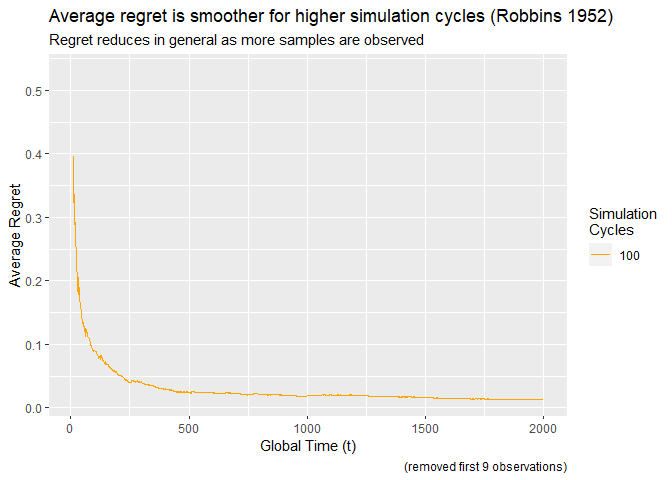
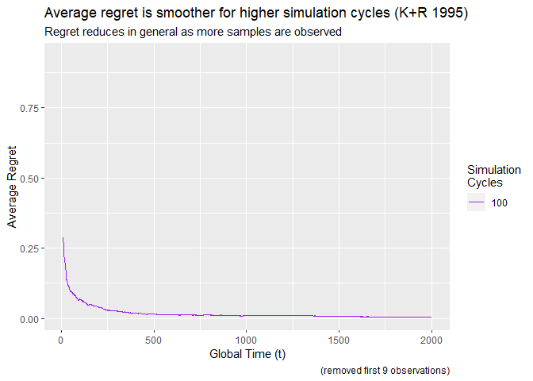
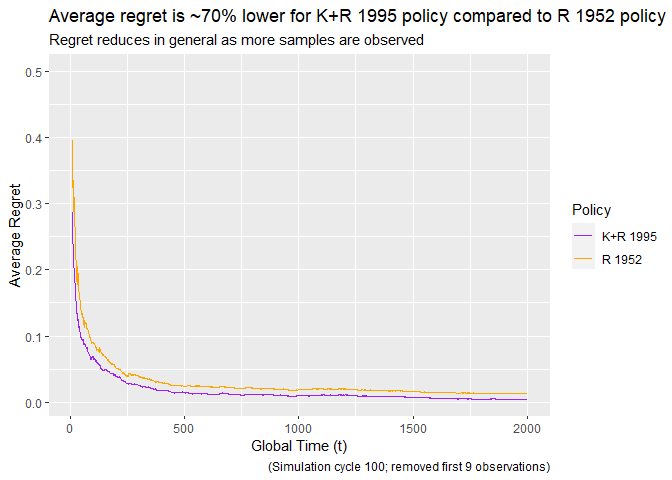

Simple UCB Policies for MAB
================
Vivek Atal
2023-02-26

- <a href="#scenario" id="toc-scenario">Scenario</a>
  - <a href="#robbins-1952" id="toc-robbins-1952">Robbins 1952</a>
  - <a href="#katehakisrobbins-1995"
    id="toc-katehakisrobbins-1995">Katehakis+Robbins 1995</a>
  - <a href="#compare-above-two-policies"
    id="toc-compare-above-two-policies">Compare above two policies</a>

# Scenario

Consider true Normal distribution parameters for 2 populations having
two different inputs:

$$
\Pi_1 : (\mu_1=10, \sigma_1=1) \text{ vs. } \Pi_2 : (\mu_2=11, \sigma_2=1) \\
\Pi_1 : (\mu_1=10, \sigma_1=2) \text{ vs. } \Pi_2 : (\mu_2=11, \sigma_2=3)
$$

where true $\mu$ is unknown and $\sigma$ is known, for the policy to
work.

Use $C=\{100,1000\}$ as simulation cycles. Within each cycle
$k=1,2,...,C$ use the Robbins 1952 policy and Katehakis+Robbins 1995
policy and compute the regret.

$$
{R^k}_t = \max(P1, P2) - \frac{1}{t} \sum_t{Y_t}^k
$$

At the end of the simulation, compute the average regret over the
simulation cycles:

$$
\bar{R}_t = \frac{1}{C}\sum_{k=1}^{C}{R^k}_t
$$

and plot $\bar{R}_t$ as a function of $t$.

## Robbins 1952

First, defining a function to identify which population to choose (which
arm to pull) as per [Robbins
(1952)](https://projecteuclid.org/euclid.bams/1183517370) policy. The
policy is as follows:

1.  Consider 2 sparse sequences of local times:

    - $1=a_1<a_2<a_3<...$ as $a_k = 2^k = 2,4,8,...$.
    - $2=b_1<b_2<b_3<...$ as $b_k = 3^k = 1,3,9,27,...$.

2.  Estimate the probabilities as:

$$
\hat{P_i}(n_i(t)) = \frac{1}{n_i(t)}\sum_{k=1}^{n_i(t)}{X_k}^i \text{ , where } i \in (1,2)
$$

3.  At time $t$, define which bandit to choose:

$$
\begin{equation}
\Pi(t) = 
\begin{cases}
1 & \text{if } t \in \{a_1,a_2,a_3,...\} \\
2 & \text{if } t \in \{b_1,b_2,b_3,...\} \\
\mathrm{argmax}_i\left(\hat{P_i}(n_i(t))\right) & \text{otherwise}
\end{cases}
\end{equation}
$$

``` r
# Bandit to use at round (global time) `t`. Using sparse sequence `a` & `b` as  
# per Robbins(1952) for bandit (population) 1 and 2 respectively. Local time of 
# usage of those bandits are captured from `n1` and `n2` respectively. And, the
# observed (simulated) outcome of the bandits are captured from `p1_simulated`
# and `p2_simulated` respectively.
arm_to_pull <- function(t, a, b, n1, n2, p1_simulated, p2_simulated) {
  if (t %in% a) {
    return(1)
  } else if (t %in% b) {
    return(2)
  } else {
    return(
      which.max(c(
        mean(p1_simulated[seq_len(n1)]), 
        mean(p2_simulated[seq_len(n2)])
      ))
    )
  }
}
```

Now we have the required function to identify which bandit to choose. It
is time to utilize it and generate regret.

``` r
# nplay: Total number of pulling the arms (#times to play), number of rounds

# m1, s1: True parameters, e.g. 10, 1
# m2, s2: True parameters, e.g. 11, 1

# `estimate_regret` function will generate the regret_t for each round (global
# time),for a given number of rounds and true probabilities of both populations.
# Optionally, a random seed parameter is provided to be able to generate 
# reproducible result.
estimate_regret <- function(nplay, m1, s1, m2, s2, seed = NULL) {
  # Sparse sequence for population (bandit) \Pi_1 as: 2^k, where it will be go 
  # till `nplay` 
  a <- 2^seq_len(floor(log(nplay) / log(2)))
  
  # Sparse sequence for population (bandit) \Pi_2 as: 3^k, where it will be go 
  # till `nplay` 
  b <- c(1, 3^seq_len(floor(log(nplay) / log(3))))
  
  if (!is.null(seed)) {
    set.seed(seed)
  }
  # Simulated outcomes (1 or 0) from population (bandit) \Pi_1
  # `nplay` random samples drawn from Bernoulli(`p1`)
  # p1_simulated <- rbinom(nplay, 1, m1)
  # Sample from Normal distribution with SD=s1, mean=m1
  p1_simulated <- rnorm(nplay, m1, s1)
  
  # Simulated outcomes (1 or 0) from population (bandit) \Pi_2
  # `nplay` random samples drawn from Bernoulli(`p2`)
  # p2_simulated <- rbinom(nplay, 1, m2)
  # Sample from Normal distribution with SD=s2, mean=m2
  p2_simulated <- rnorm(nplay, m2, s2)
  
  # Local time tracker for bandit 1 & 2 respectively - initializing at 0
  n1 <- 0
  n2 <- 0
  
  # Observed outcome tracker
  observed <- c()
  
  # Now playing the game `nplay` times
  for (t in seq_len(nplay)) {
    # Choose the bandit
    bandit_chosen <- arm_to_pull(t, a, b, n1, n2, p1_simulated, p2_simulated)
    # If bandit_i is chosen then increase its local time and update the
    # observed value by fetching the respective sample number from simulated 
    # data.
    if (bandit_chosen == 1) {
      n1 <- n1 + 1
      observed <- c(observed, p1_simulated[n1])
    } else if (bandit_chosen == 2) {
      n2 <- n2 + 1
      observed <- c(observed, p2_simulated[n2])
    }
  }
  
  # Regret for time t is defined as: max(p1, p2) - average(observed till time t)
  regret <- (
    max(m1, m2) - sapply(seq_len(nplay), \(t) sum(observed[seq_len(t)]) / t)
  )
  # Return the Regret series, and number of times the sample was drawn from
  # each population
  return(list(regret_series = regret, ndraw_pop1 = n1, ndraw_pop2 = n2))
}
```

Now generate the ${R^k}_t$ series multiple times based on the defined
simulation cycle. Basically, generating regret value for each round
($t$), multiple times based on the the simulation cycle
($k \in \{1:C\}$). If simulation cycle is 10 ($C$), then regret for
round number (global time) 1 is generated 10 times using different
observed samples in each of those 10 sets.

``` r
# Set random seed for reproducible outputs - NULL means it is NOT reproducible.
set.seed(20)

# Set the number of rounds, and distribution parameters
rounds <- 2000
m1 <- 10
s1 <- 1
m2 <- 11
s2 <- 1

# Generate Regret for simulation cycle: 100
regret_cycle100 <- lapply(
  seq_len(100), 
  \(x) estimate_regret(nplay = rounds, m1 = m1, s1 = s1, m2 = m2, s2 = s2)$regret_series
)

# Plot average regret based on simulation cycles
library(ggplot2)
ggplot(mapping = aes(x = seq_len(rounds))) +
  geom_line(aes(y = colMeans(do.call(rbind, regret_cycle100)), 
                color = "100")) +
  scale_color_manual(
    name = "Simulation\nCycles",
    values = c("100" = "orange")
  ) +
  # Limiting X-axis from 10 till the end to omit initial huge variation
  xlim(10, NA) +
  labs(x = "Global Time (t)", y = "Average Regret",
       title = "Average regret is smoother for higher simulation cycles (Robbins 1952)",
       subtitle = "Regret reduces in general as more samples are observed",
       caption = "(removed first 9 observations)")
```

    ## Warning: Removed 9 rows containing missing values (`geom_line()`).

<!-- -->

Calculate the standard deviation of ${R^k}_t$ over simulation cycles.

``` r
# Extracted last 100 rounds
apply(do.call(rbind, regret_cycle100), 2, sd)[-(1:max(1, rounds - 100))]
```

    ##   [1] 0.10053185 0.10062332 0.10062905 0.10058454 0.10052701 0.10050268
    ##   [7] 0.10047638 0.10042761 0.10055540 0.10059028 0.10051400 0.10049665
    ##  [13] 0.10056084 0.10045292 0.10051776 0.10043823 0.10043749 0.10040930
    ##  [19] 0.10039526 0.10046364 0.10039443 0.10039009 0.10038109 0.10044038
    ##  [25] 0.10048300 0.10046680 0.10056325 0.10053623 0.10060887 0.10060490
    ##  [31] 0.10070609 0.10065907 0.10061233 0.10064155 0.10066118 0.10066200
    ##  [37] 0.10056285 0.10056800 0.10049148 0.10047012 0.10032331 0.10037558
    ##  [43] 0.10045381 0.10042441 0.10046693 0.10046398 0.10048432 0.10040181
    ##  [49] 0.10043032 0.10046007 0.10048867 0.10041188 0.10042220 0.10044670
    ##  [55] 0.10047326 0.10045527 0.10044016 0.10041435 0.10048790 0.10050278
    ##  [61] 0.10042960 0.10043052 0.10039573 0.10046944 0.10038360 0.10034094
    ##  [67] 0.10033103 0.10036360 0.10039162 0.10038832 0.10041219 0.10032424
    ##  [73] 0.10023327 0.10020582 0.10020842 0.10013455 0.10006390 0.10011931
    ##  [79] 0.10010317 0.10011519 0.10011709 0.10011437 0.10005081 0.10004497
    ##  [85] 0.10000856 0.09999015 0.09997747 0.09994723 0.09996449 0.09993794
    ##  [91] 0.09993160 0.09994526 0.09998340 0.09998215 0.09995363 0.09993754
    ##  [97] 0.10000401 0.10000579 0.09995047 0.09986546

Extract the number of times each population is considered in the
experiment.

``` r
# Set random seed for reproducible outputs - NULL means it is NOT reproducible.
set.seed(NULL)
# The number of times sample was drawn from each population
result1 <- estimate_regret(nplay = 1000, m1 = 10, s1 = 1, m2 = 11, s2 = 1)
paste0("#samples drawn from pop1: ", result1$ndraw_pop1, " and from pop2: ",
       result1$ndraw_pop2)
```

    ## [1] "#samples drawn from pop1: 11 and from pop2: 989"

## Katehakis+Robbins 1995

First, defining a function to identify which population to choose (which
arm to pull) as per [Katehakis+Robbins
(1995)](https://www.ncbi.nlm.nih.gov/pmc/articles/PMC41010/pdf/pnas01497-0061.pdf)
policy. The policy is as follows:

1.  At times $t = i$ choose population $i$, where $i \in \{1,2\}$.

2.  Calculate sample estimates:

$$
\bar{X^i}_{n_i(t)} = \frac{1}{n_i(t)}\sum_{k=1}^{n_i(t)}{X_k}^i \text{ , where } i \in (1,2)
$$

and the UCB index as:

$$
UCB_i(t, \bar{X^i}_{n_i(t)}) = \bar{X^i}_{n_i(t)} + \sigma_i \sqrt{\frac{2*log(t)}{n_i(t)}}
$$

3.  At time $t$, define which bandit to choose:

$$
\begin{equation}
\Pi(t) = 
\begin{cases}
1 & \text{if } t \in \{1\} \\
2 & \text{if } t \in \{2\} \\
\mathrm{argmax}_i\left(UCB_i(t, \bar{X^i}_{n_i(t)})\right) & \text{otherwise}
\end{cases}
\end{equation}
$$

``` r
# Bandit to use at round (global time) `t`. Using known sigma `s1` & `s2` as  
# per Katehakis+Robbins(1995) for bandit (population) 1 and 2 respectively.
# Local time of usage of those bandits are captured from `n1` and `n2`
# respectively. And, the observed (simulated) outcome of the bandits are
# captured from `p1_simulated` and `p2_simulated` respectively.
arm_to_pull_kr <- function(t, s1, s2, n1, n2, p1_simulated, p2_simulated) {
  if (t == 1) {
    return(1)
  } else if (t == 2) {
    return(2)
  } else {
    return(
      which.max(c(
        mean(p1_simulated[seq_len(n1)]) + s1 * sqrt(2 * log(t) / n1), 
        mean(p2_simulated[seq_len(n2)]) + s2 * sqrt(2 * log(t) / n2)
      ))
    )
  }
}
```

Now we have the required function to identify which bandit to choose. It
is time to utilize it and generate regret.

``` r
# nplay: Total number of pulling the arms (#times to play), number of rounds

# m1, s1: True parameters, e.g. 10, 1
# m2, s2: True parameters, e.g. 11, 1

# `estimate_regret` function will generate the regret_t for each round (global
# time),for a given number of rounds and true probabilities of both populations.
# Optionally, a random seed parameter is provided to be able to generate 
# reproducible result.
estimate_regret_kr <- function(nplay, m1, s1, m2, s2, seed = NULL) {
  # Sparse sequence for population (bandit) \Pi_1 as: 2^k, where it will be go 
  # till `nplay` 
  # a <- 2^seq_len(floor(log(nplay) / log(2)))
  
  # Sparse sequence for population (bandit) \Pi_2 as: 3^k, where it will be go 
  # till `nplay` 
  # b <- c(1, 3^seq_len(floor(log(nplay) / log(3))))
  
  if (!is.null(seed)) {
    set.seed(seed)
  }
  # Simulated outcomes (1 or 0) from population (bandit) \Pi_1
  # `nplay` random samples drawn from Bernoulli(`p1`)
  # p1_simulated <- rbinom(nplay, 1, m1)
  # Sample from Normal distribution with SD=s1, mean=m1
  p1_simulated <- rnorm(nplay, m1, s1)
  
  # Simulated outcomes (1 or 0) from population (bandit) \Pi_2
  # `nplay` random samples drawn from Bernoulli(`p2`)
  # p2_simulated <- rbinom(nplay, 1, m2)
  # Sample from Normal distribution with SD=s2, mean=m2
  p2_simulated <- rnorm(nplay, m2, s2)
  
  # Local time tracker for bandit 1 & 2 respectively - initializing at 0
  n1 <- 0
  n2 <- 0
  
  # Observed outcome tracker
  observed <- c()
  
  # Now playing the game `nplay` times
  for (t in seq_len(nplay)) {
    # Choose the bandit
    bandit_chosen <- arm_to_pull_kr(t, s1, s2, n1, n2, p1_simulated, p2_simulated)
    # If bandit_i is chosen then increase its local time and update the
    # observed value by fetching the respective sample number from simulated 
    # data.
    if (bandit_chosen == 1) {
      n1 <- n1 + 1
      observed <- c(observed, p1_simulated[n1])
    } else if (bandit_chosen == 2) {
      n2 <- n2 + 1
      observed <- c(observed, p2_simulated[n2])
    }
  }
  
  # Regret for time t is defined as: max(p1, p2) - average(observed till time t)
  regret <- (
    max(m1, m2) - sapply(seq_len(nplay), \(t) sum(observed[seq_len(t)]) / t)
  )
  # Return the Regret series, and number of times the sample was drawn from
  # each population
  return(list(regret_series = regret, ndraw_pop1 = n1, ndraw_pop2 = n2))
}
```

Now generate the ${R^k}_t$ series multiple times based on the defined
simulation cycle. Basically, generating regret value for each round
($t$), multiple times based on the the simulation cycle
($k \in \{1:C\}$). If simulation cycle is 10 ($C$), then regret for
round number (global time) 1 is generated 10 times using different
observed samples in each of those 10 sets.

``` r
# Set random seed for reproducible outputs - NULL means it is NOT reproducible.
set.seed(20)

# Set the number of rounds, and distribution parameters
rounds <- 2000
m1 <- 10
s1 <- 1
m2 <- 11
s2 <- 1

# Generate Regret for simulation cycle: 100
regret_cycle100_kr <- lapply(
  seq_len(100), 
  \(x) estimate_regret_kr(nplay = rounds, m1 = m1, s1 = s1, m2 = m2, s2 = s2)$regret_series
)

# Plot average regret based on simulation cycles
library(ggplot2)
ggplot(mapping = aes(x = seq_len(rounds))) +
  geom_line(aes(y = colMeans(do.call(rbind, regret_cycle100_kr)), 
                color = "100")) +
  scale_color_manual(
    name = "Simulation\nCycles",
    values = c("100" = "purple")
  ) +
  # Limiting X-axis from 10 till the end to omit initial huge variation
  xlim(10, NA) +
  labs(x = "Global Time (t)", y = "Average Regret",
       title = "Average regret is smoother for higher simulation cycles (K+R 1995)",
       subtitle = "Regret reduces in general as more samples are observed",
       caption = "(removed first 9 observations)")
```

    ## Warning: Removed 9 rows containing missing values (`geom_line()`).

<!-- -->

Calculate the standard deviation of ${R^k}_t$ over simulation cycles.

``` r
# Extracted last 100 rounds
apply(do.call(rbind, regret_cycle100_kr), 2, sd)[-(1:max(1, rounds - 100))]
```

    ##   [1] 0.02324252 0.02326573 0.02321112 0.02316251 0.02328716 0.02325770
    ##   [7] 0.02327406 0.02326397 0.02329561 0.02324889 0.02321693 0.02314405
    ##  [13] 0.02309105 0.02309687 0.02306686 0.02298968 0.02298703 0.02306306
    ##  [19] 0.02306178 0.02302769 0.02294544 0.02293641 0.02294739 0.02296545
    ##  [25] 0.02290137 0.02295501 0.02298105 0.02297079 0.02295390 0.02293722
    ##  [31] 0.02295127 0.02300852 0.02299502 0.02296583 0.02293241 0.02291360
    ##  [37] 0.02289016 0.02294763 0.02289802 0.02290339 0.02290444 0.02284459
    ##  [43] 0.02286610 0.02287625 0.02280368 0.02280538 0.02285198 0.02279451
    ##  [49] 0.02283793 0.02281523 0.02285974 0.02275881 0.02275923 0.02284318
    ##  [55] 0.02289035 0.02288168 0.02284333 0.02283526 0.02284755 0.02280936
    ##  [61] 0.02271439 0.02272000 0.02269953 0.02276523 0.02285342 0.02288562
    ##  [67] 0.02284658 0.02282811 0.02285688 0.02284240 0.02277446 0.02268051
    ##  [73] 0.02256749 0.02255963 0.02263402 0.02264841 0.02261442 0.02258569
    ##  [79] 0.02266438 0.02266415 0.02266435 0.02269109 0.02265953 0.02257260
    ##  [85] 0.02256338 0.02260697 0.02260342 0.02254547 0.02256336 0.02256745
    ##  [91] 0.02259218 0.02252000 0.02250429 0.02254578 0.02262764 0.02266019
    ##  [97] 0.02261968 0.02257991 0.02261930 0.02267826

Extract the number of times each population is considered in the
experiment.

``` r
# Set random seed for reproducible outputs - NULL means it is NOT reproducible.
set.seed(NULL)
# The number of times sample was drawn from each population
result1_kr <- estimate_regret_kr(nplay = 1000, m1 = 10, s1 = 1, m2 = 11, s2 = 1)
paste0("#samples drawn from pop1: ", result1_kr$ndraw_pop1, " and from pop2: ",
       result1_kr$ndraw_pop2)
```

    ## [1] "#samples drawn from pop1: 7 and from pop2: 993"

## Compare above two policies

Now let us compare the average regret over time for above two policies.

``` r
ggplot(mapping = aes(x = seq_len(rounds))) +
  geom_line(aes(y = colMeans(do.call(rbind, regret_cycle100)), 
                color = "R 1952")) +
  geom_line(aes(y = colMeans(do.call(rbind, regret_cycle100_kr)), 
                color = "K+R 1995")) +
  scale_color_manual(
    name = "Policy",
    values = c("R 1952" = "orange", "K+R 1995" = "purple")
  ) +
  # Limiting X-axis from 10 till the end to omit initial huge variation
  xlim(10, NA) + ylim(NA, 0.5) +
  labs(x = "Global Time (t)", y = "Average Regret",
       title = "Average regret is ~70% lower for K+R 1995 policy compared to R 1952 policy",
       subtitle = "Regret reduces in general as more samples are observed",
       caption = "(Simulation cycle 100; removed first 9 observations)")
```

    ## Warning: Removed 9 rows containing missing values (`geom_line()`).
    ## Removed 9 rows containing missing values (`geom_line()`).

<!-- -->
