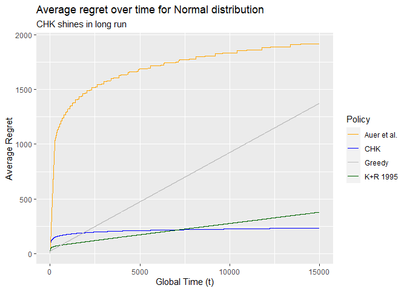
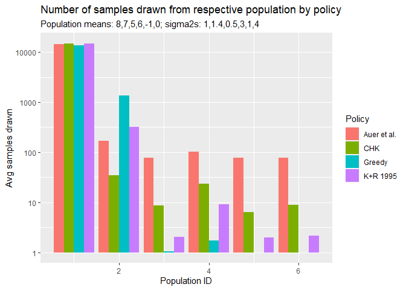
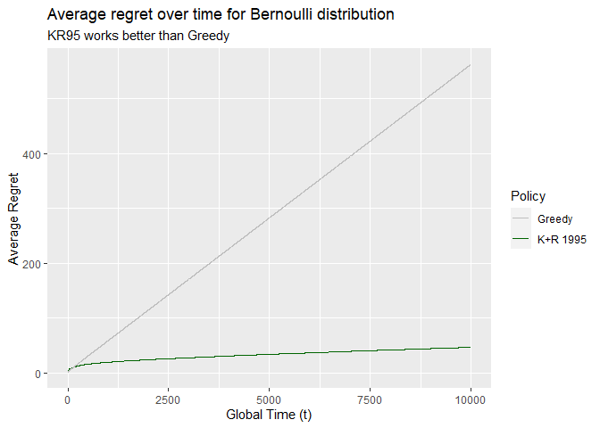
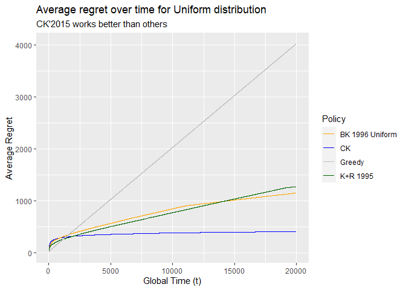
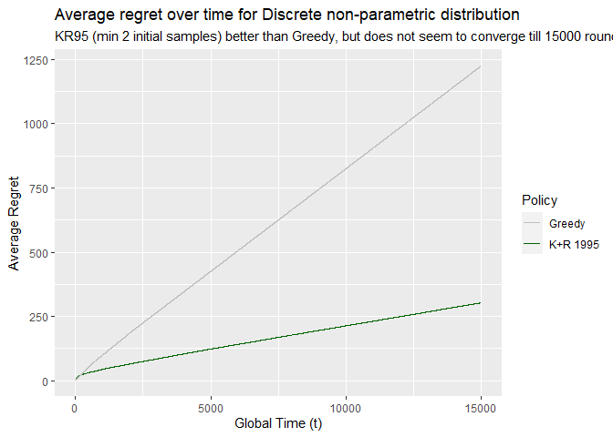

Compare UCB Policies & Simulate Regret
================
Vivek Atal
2023-03-12

- <a href="#regret-with-ucb" id="toc-regret-with-ucb">Regret with UCB</a>
  - <a href="#sequential-sampling-overview"
    id="toc-sequential-sampling-overview">Sequential sampling overview</a>
    - <a href="#ucb-policies-considered" id="toc-ucb-policies-considered">UCB
      policies considered</a>
  - <a href="#codes" id="toc-codes">Codes</a>
    - <a href="#core-functions" id="toc-core-functions">Core functions</a>
    - <a href="#simulate-regret" id="toc-simulate-regret">Simulate regret</a>

# Regret with UCB

## Sequential sampling overview

This notebook includes implementation of multiple UCB policies to choose
a population to take sample from (choose a bandit).

1.  First, considering the case where the populations follow
    `Normal distribution` with unknown mean and unknown variance.

2.  Second, considering the case where the populations follow
    `Bernoulli distribution` with unknown success probability.

3.  Third, considering the case where the populations follow
    `Uniform distribution` with unknown location parameters $a$ & $b$.

4.  Fourth, considering the case where the populations follows a given
    discrete `Non-parametric distribution` taking values `[1, 2, 3]`
    with respective probabilities `[p1, p2, p3]` such that
    $\sum_i(p_i)=1$.

Objective is to devise a policy so that we can choose the population
more often which has highest true mean.

### UCB policies considered

We have $N (>1)$ populations (or bandits) to draw a sample from (pull
bandit’s arm). $X^i_j \sim \mathcal{N}(\mu_i, \sigma^2_i)$ denotes the
random variable from population $i$ sampled at time $j$. Analogously,
$X^i_j \sim \mathcal{B}(p_i)$ when populations are Bernoulli; and
$X^i_j \sim \mathcal{U}(a_i, b_i)$ when populations are Uniform. Local
time of population (bandit) $i$ at global time (round) $t$ for a given
policy $\pi$ is denoted by $T^i_{\pi}(t)$. We will consider calculating
the regret (in expectation) at time $t$ as following; note that it is
different from the regret per unit of time which was used in the Robbins
1952 paper.

$$
R_{\pi}(t) = t  \mu^* - \sum_{i=1}^N \mu_i \mathbb{E}(T^i_{\pi}(t)) \text{ , where } \mu^* \text{ is } max_i(\mu_i)
$$

Essentially, it is the cumulative sum of $\mu^*-\mu(t)$ where $\mu(t)$
is the true mean of the population sampled at global time (round) $t$.

#### Normal population

In case of populations coming from Normal distribution, four different
UCB policy variations are explored here which are described briefly
below. For evaluation of their performance, we simulated some data;
considering $N=6$ different populations whose true mean and true
variance is as per the below table:

|    Param     | Pop1 | Pop2  | Pop3  | Pop4 | Pop5 | Pop6 |
|:------------:|:----:|:-----:|:-----:|:----:|:----:|:----:|
|   $\mu_i$    | $8$  |  $7$  |  $5$  | $6$  | $-1$ | $0$  |
| $\sigma^2_i$ | $1$  | $1.4$ | $0.5$ | $3$  | $1$  | $4$  |

Table of true population parameters (Normal)

#### Bernoulli & Uniform population

In case of populations coming from Bernoulli and Uniform distributions,
one more UCB policy variation is explored for each of them which is also
described briefly below. For evaluation of their performance, we
simulated some data; considering $N=4$ different populations whose true
parameters described in the below tables:

| Param | Pop1  | Pop2  | Pop3  | Pop4  |
|:-----:|:-----:|:-----:|:-----:|:-----:|
| $p_i$ | $0.1$ | $0.5$ | $0.7$ | $0.9$ |

Table of true population parameters (Bernoulli)

| Param | Pop1 | Pop2 | Pop3 | Pop4 |
|:-----:|:----:|:----:|:----:|:----:|
| $a_i$ | $1$  | $10$ | $20$ | $15$ |
| $b_i$ | $30$ | $30$ | $30$ | $30$ |

Table of true population parameters (Uniform)

#### Discrete non-parametric population

In case of populations coming from a specific type of discrete
non-parametric distributions, two different UCB policy variations are
explored. For evaluation of their performance, we simulated some data.
True distributions are described in the below table where first column
is the possible value and second column onward is respective probability
by different population:

| Value | Prob. $\Pi_1$ | Prob. $\Pi_2$ | Prob. $\Pi_3$ | Prob. $\Pi_3$ |
|:-----:|:-------------:|:-------------:|:-------------:|:-------------:|
|  $1$  | $\frac{1}{3}$ |     $0.5$     |      $0$      |      $0$      |
|  $2$  | $\frac{1}{3}$ |      $0$      |     $0.5$     |    $0.25$     |
|  $3$  | $\frac{1}{3}$ |     $0.5$     |     $0.5$     |    $0.75$     |

Table of true population parameters (Discrete non-parametric)

**If initial minimum samples drawn from each population is changed then
the simulation rounds should also be changed to see the impact in
action.**

**In all the below UCB index formulae, we will use the biased estimator
of** $\sigma$, using $T^i_{\pi}(t)$ in denominator.

##### CHK (2018)

Referring to Cowan + Honda + Katehakis Optimal policy as described in
the [CHK research
paper](https://www.jmlr.org/papers/volume18/15-154/15-154.pdf)

1.  For $t = 1,2,3,...,3N$ sample each bandit 3 times, and
2.  for $t > 3N$, sample from the bandit $i^*$ identified by `argmax` of
    below UCB index

$$
\bar{X}^i_{T^i_{\pi}(t)} + \hat{\sigma}^i_{T^i_{\pi}(t)}\sqrt{t^{\frac{2}{T^i_{\pi}(t)-2}}-1}
$$

##### Auer et al. (2002)

Referring to Auer et al. policy as described in the [CHK research
paper](https://www.jmlr.org/papers/volume18/15-154/15-154.pdf)

1.  Sample from any bandit $i$ for which
    $T^i_{\pi}(t) < \lceil 8 \ln t \rceil$.
2.  If $T^i_{\pi}(t) \ge \lceil 8 \ln t \rceil$, for all
    $i=1,2,3,...,N$, sample from the bandit $i^*$ identified by `argmax`
    of below UCB index

$$
\bar{X}^i_{T^i_{\pi}(t)} + 4 \hat{\sigma}^i_{T^i_{\pi}(t)}\sqrt{\frac{\ln t}{T^i_{\pi}(t)}}
$$

##### Katehakis + Robbins (1995)

Referring to Katehakis + Robbins (1995) policy as described in the [K+R
1995 research
paper](https://www.ncbi.nlm.nih.gov/pmc/articles/PMC41010/pdf/pnas01497-0061.pdf).
It is slightly modified as we are using the $\hat{\sigma}$ instead of
true $\sigma$. Also, since we need to calculate $\hat{\sigma}$, we will
draw 2 samples from each population instead of just 1. *Having minimum 2
initial samples produced significantly better result than having it as
1*. This policy to be simulated on populations having
`Normal, Uniform, Bernoulli, non-parametric distributions`.

1.  For $t = 1,2,3,...,2N$ sample each bandit 2 times, and
2.  for $t > 2N$, sample from the bandit $i^*$ identified by `argmax` of
    below UCB index

$$
\bar{X}^i_{T^i_{\pi}(t)} + \hat{\sigma}^i_{T^i_{\pi}(t)}\sqrt{\frac{2 \ln t}{T^i_{\pi}(t)}}
$$

##### Greedy policy

Referring to the policy as described in the [Robbins 1952 research
paper](https://projecteuclid.org/euclid.bams/1183517370). It is modified
slightly as we are reusing the close to CHK logic of sampling for
initial period.

1.  For $t = 1,2,3,...,N$ sample each bandit 1 time, and
2.  for $t > N$, sample from the bandit $i^*$ identified by `argmax` of
    below UCB index

$$
\bar{X}^i_{T^i_{\pi}(t)}
$$

##### CK (2015)

Referring to Cowan + Katehakis Optimal policy as described in the
[Uniform Populations, Cowan Katehakis (2015)
paper](https://arxiv.org/pdf/1505.01918.pdf). This policy to be
simulated on populations having `Uniform distribution`.

1.  For $t = 1,2,3,...,3N$ sample each bandit 3 times, and
2.  for $t > 3N$, sample from the bandit $i^*$ identified by `argmax` of
    below UCB index

$$
\hat{a}^i_{T^i_{\pi}(t)} + \frac{1}{2} \left(\hat{b}^i_{T^i_{\pi}(t)} - \hat{a}^i_{T^i_{\pi}(t)}\right) t^{\frac{1}{T^i_{\pi}(t)-2}}
$$

Here, $\hat{a}^i_{t}=\min_{t' \le t} X^i_{t'}$ and
$\hat{b}^i_{t}=\max_{t' \le t} X^i_{t'}$.

##### BK (1996) Uniform

Referring to Burnetas + Katehakis Adaptive policy as referenced in the
[Uniform Populations, Cowan Katehakis (2015)
paper](https://arxiv.org/pdf/1505.01918.pdf). This policy to be
simulated on populations having `Uniform distribution`.

1.  For $t = 1,2,3,...,2N$ sample each bandit 2 times, and
2.  for $t > 2N$, sample from the bandit $i^*$ identified by `argmax` of
    below UCB index

$$
\hat{a}^i_{T^i_{\pi}(t)} + \frac{1}{2} \left(\hat{b}^i_{T^i_{\pi}(t)} - \hat{a}^i_{T^i_{\pi}(t)}\right) t^{\frac{1}{T^i_{\pi}(t)}}
$$

Here, $\hat{a}^i_{t}=\min_{t' \le t} X^i_{t'}$ and
$\hat{b}^i_{t}=\max_{t' \le t} X^i_{t'}$.

## Codes

### Core functions

We will structure the code into following functions,

1.  `arm_to_pull`: Identify which population to draw sample from at a
    given global time $t$. This function to be made up of two
    sub-functions:
    1.  `initial_sample_from`: Chosen population for initial sampling
        without considering the respective UCB index.
    2.  `ucb_sample_from`: Chosen population for further sampling
        considering the `argmax` of respective UCB index.
2.  `estimate_regret`: Draw sample from the chosen population as defined
    by `arm_to_pull`. **For computation efficiency**, we will recompute
    and store only below $N$-sized vector, which are sufficient to
    calculate mean and standard deviation of observed samples from each
    of $N$ populations at any given global time $t$.
    1.  the number of times each population is sampled from,
    2.  the sum of sample values observed, and
    3.  the sum of squares of sample values observed.

``` r
# Safer alternate to take random sample from x, per ?sample doc
resample <- function(x, ...) {
  x[sample.int(length(x), ...)]
}

# local_timer: vector of size N (total number of populations) having local time
# policy: one of "chk", "kr95", "ar02", "greedy", "ck", "bkuni"
initial_sample_from <- function(local_timer, policy) {
  # vector of population id of size N
  pop_indicator <- seq_len(length(local_timer))
  # global timer is just sum of local time of all populations
  global_timer <- sum(local_timer)
  # at max 'fixed_number' of initial samples to draw from each population
  if (policy == "ar02") {
    # First time global timer is 0, log undefined
    fixed_number <- ifelse(
      is.finite(ceiling(8*log(global_timer))),
      ceiling(8*log(global_timer)),
      1
    )
  } else if (policy == "chk") {
    fixed_number <- 3
  } else if (policy == "ck") {
    fixed_number <- 3
  } else if (policy == "kr95") {
    fixed_number <- 2 # keeping it 2 instead of 1 produces much better results
  } else if (policy == "greedy") {
    fixed_number <- 1
  } else if (policy == "bkuni") {
    fixed_number <- 2
  } else {
    stop("Choose correct policy!")
  }
  # which population id's are yet to be sampled from to meet initial criteria
  yet_to_sample <- pop_indicator[local_timer < fixed_number]
  # randomly choose one of the population yet to be sampled
  # return empty vector if nothing left to be sampled per initial logic
  chosen <- resample(yet_to_sample, 
                     size = min(1, length(yet_to_sample)), 
                     replace = FALSE)
  return(chosen)
}

# local_timer: vector of size N (total number of populations) having local time
# policy: one of "chk", "kr95", "ar02", "greedy", "ck", "bkuni"
# sum_sample, sum_square_sample: vector of size N (number of populations) having
#   the sum and sum of squares respectively of already observed samples
# min_sample, max_sample: vector of size N (number of populations) having
#   the min and max respectively of already observed samples
ucb_sample_from <- function(local_timer, policy,
                            sum_sample, sum_square_sample,
                            min_sample, max_sample) {
  # global timer is just sum of local time of all populations
  global_timer <- sum(local_timer)
  # X^bar is just sum of sample values observed so far divided by the number of
  #  times it is sampled, for each population
  mean_hat <- sum_sample / local_timer
  # sigma^hat is just the standard deviation of sample values observed so far,
  #  for each population. variance = 1/n sum(x^2) - (x^bar)^2
  sigma_hat <- sqrt(sum_square_sample / local_timer - mean_hat^2)
  # UCB index values for each policy
  if (policy == "ar02") {
    ucb <- mean_hat + 4 * sigma_hat * sqrt(
      log(global_timer) / local_timer
    )
  } else if (policy == "chk") {
    ucb <- mean_hat + sigma_hat * sqrt(
      global_timer^(2 / (local_timer - 2)) - 1
    )
  } else if (policy == "kr95") {
    ucb <- mean_hat + sigma_hat * sqrt(
      2 * log(global_timer) / local_timer
    )
  } else if (policy == "greedy") {
    ucb <- mean_hat
  } else if (policy == "ck") {
    ucb <- (
      min_sample + 0.5 * (max_sample - min_sample) * 
        global_timer^(1 / (local_timer - 2))
    )
  } else if (policy == "bkuni") {
    ucb <- (
      min_sample + 0.5 * (max_sample - min_sample) * 
        global_timer^(1 / local_timer)
    )
  } else {
    stop("Choose correct policy!")
  }
  # argmax of UCB index for given policy, the chosen population
  argmax <- which.max(ucb)
  return(argmax)
}

# local_timer: vector of size N (total number of populations) having local time
# policy: one of "chk", "kr95", "ar02", "greedy", "ck"
# sum_sample, sum_square_sample: vector of size N (number of populations) having
#   the sum ans sum of squares respectively of already observed samples
# min_sample, max_sample: vector of size N (number of populations) having
#   the min and max respectively of already observed samples
arm_to_pull <- function(local_timer, policy,
                        sum_sample, sum_square_sample,
                        min_sample, max_sample) {
  # identify population id based on initial sampling logic
  # if initial pop id is empty then consider pop id based on UCB logic
  initial_pop <- initial_sample_from(local_timer, policy)
  if (length(initial_pop) > 0) {
    return(initial_pop)
  } else {
    ucb_pop <- ucb_sample_from(local_timer, policy,
                               sum_sample, sum_square_sample,
                               min_sample, max_sample)
    return(ucb_pop)
  }
}

# rounds: total number of times to play the game
# true_population: one of "normal", "bernoulli", "uniform". The distribution
#   form where the data is generated.
# true_params: True population distribution parameter spec for the number of
#   bandits. It is a nested list, list index should refer to the true_population
#   and the further list is the respective distribution's parameter specs. If
#   there are 6 populations to choose from then the respective parameter spec
#   should be of relevant size (6 mu's & 6 sigma2's for Normal distribution).
# policy: one of "chk", "kr95", "ar02", "greedy", "ck"
estimate_regret <- function(
    rounds,
    true_population = "normal",
    true_params = list(
      normal = list(mu = c(), sigma2 = c()),
      bernoulli = list(p = c()),
      uniform = list(a = c(), b = c()),
      dnonpara = list(value = c(), probs = list(c(), c()))
    ),
    policy
  ) {
  # Identify number of populations available to choose from
  npop <- max(sapply(true_params[[true_population]], length))
  # Define population mean of respective populations based on param spec
  if (true_population == "normal") {
    pop_mean <- true_params[[true_population]]$mu
  } else if (true_population == "bernoulli") {
    pop_mean <- true_params[[true_population]]$p
  } else if (true_population == "uniform") {
    pop_mean <- (true_params[[true_population]]$a +
                   true_params[[true_population]]$b) / 2
  } else if (true_population == "dnonpara") {
    pop_mean <- sapply(
      true_params[[true_population]]$probs,
      \(x) sum(x * true_params[[true_population]]$value)
    )
  }
  # initialize local timer of each population to 0
  # and initialize sum, sum_sq to 0; min, max to NA to track for samples drawn
  # from each population
  local_timer <- sum_samples <- sum_sq_samples <- rep(0, npop)
  min_samples <- max_samples <- rep(NA, npop)
  # initialize loss due to ignorance to empty vector
  ignorance_loss <- numeric()
  # Now playing the game `rounds` times
  for (t in seq_len(rounds)) {
    # Choose the bandit (population to draw sample from)
    bandit_chosen <- arm_to_pull(local_timer, policy,
                                 sum_samples, sum_sq_samples,
                                 min_samples, max_samples)
    # draw a random sample from chosen population
    if (true_population == "normal") {
      sample <- rnorm(
        1,
        pop_mean[bandit_chosen],
        sqrt(true_params[[true_population]]$sigma2[bandit_chosen])
      )
    } else if (true_population == "bernoulli") {
      sample <- rbinom(
        1,
        1,
        true_params[[true_population]]$p[bandit_chosen]
      )
    } else if (true_population == "uniform") {
      sample <- runif(
        1,
        true_params[[true_population]]$a[bandit_chosen],
        true_params[[true_population]]$b[bandit_chosen]
      )
    } else if (true_population == "dnonpara") {
      sample <- sample(
        x = true_params[[true_population]]$value,
        size = 1,
        prob = true_params[[true_population]]$probs[[bandit_chosen]]
      )
    }
    # update ignorance loss
    ignorance_loss <- c(ignorance_loss,
                        max(pop_mean) - pop_mean[bandit_chosen])
    # update local timer, sum of samples, sum of squares of samples for
    #   chosen bandit 
    local_timer[bandit_chosen] <- local_timer[bandit_chosen] + 1
    sum_samples[bandit_chosen] <- sum_samples[bandit_chosen] + sample
    sum_sq_samples[bandit_chosen] <- sum_sq_samples[bandit_chosen] + sample^2
    min_samples[bandit_chosen] <- min(c(min_samples[bandit_chosen], sample),
                                      na.rm = TRUE)
    max_samples[bandit_chosen] <- max(c(max_samples[bandit_chosen], sample),
                                      na.rm = TRUE)
  }
  # Regret for time t is defined as cumulative sum of loss due to ignorance
  regret <- cumsum(ignorance_loss)
  # Return the Regret series, and number of times sample was drawn from
  # each population (local timer)
  return(list(regret_series = regret, nsamples_drawn = local_timer))
}

# Trying to save space while simulating - all we care is avg of regret over
# simulation cycles which needs to be plotted over time. Hence, we can just
# track the sum of regret values over simulation cycles after each cycle is
# finished simulating, and eventually divide by number of simulation cycles.
# This is a wrapper around the estimate_regret function with only one extra
# argument for number of simulation cycles.
sim_cycle_regret <- function(
    rounds,
    true_population = "normal",
    true_params = list(
      normal = list(mu = c(), sigma2 = c()),
      bernoulli = list(p = c()),
      uniform = list(a = c(), b = c()),
      dnonpara = list(value = c(), probs = list(c(), c()))
    ),
    policy,
    sim_cycles = 100
  ) {
  # Identify number of populations available to choose from
  npop <- max(sapply(true_params[[true_population]], length))
  # track sum of regret over simulation cycles - initialize at 0
  tmp_sum_reg <- tmp_sum_sq_reg <- rep(0, rounds)
  tmp_sum_nsamples <- rep(0, npop)
  for (i in seq_len(sim_cycles)) {
    res <- estimate_regret(rounds, true_population, true_params, policy)
    tmp_sum_reg <- tmp_sum_reg + res$regret_series
    tmp_sum_sq_reg <- tmp_sum_sq_reg + (res$regret_series)^2
    tmp_sum_nsamples <- tmp_sum_nsamples + res$nsamples_drawn
  }
  return(list(
    avg_regret = tmp_sum_reg / sim_cycles,
    sd_regret = sqrt(
      round(tmp_sum_sq_reg / sim_cycles - (tmp_sum_reg / sim_cycles)^2, 6)
    ),
    avg_samples_drawn = tmp_sum_nsamples / sim_cycles
  ))
}
```

### Simulate regret

Now generate the $R_{\pi}(t)$ series multiple times based on the defined
simulation cycle. Basically, generating regret value for each round
($t$), multiple times based on the the simulation cycle
($k \in \{1:C\}$). If simulation cycle is 10 ($C$), then regret for
round number (global time) 1, 2, 3, … each is generated 10 times using
different observed samples in each of those 10 sets.

#### Normal population

Using CHK’2018, Auer et al. 2002, K+R’95 & Greedy to compare their
performance.

``` r
# Set random seed for reproducible outputs - NULL means it is NOT reproducible.
set.seed(20)

# Set the number of rounds, and distribution parameters
rounds <- 15000 # increasing rounds to 150K will probably reveal CHK18 the best
#   if minsample of K+R'95 is set to 2 instead of 1.
pop_means <- c(8, 7, 5, 6, -1, 0)
pop_sigma2s <- c(1, 1.4, 0.5, 3, 1, 4)
# Simulation cycles
sim_cycles <- 100

# Generate Regret for a given simulation cycle and policy - CHK
result_chk <- sim_cycle_regret(
  rounds, true_population = "normal",
  true_params = list(normal = list(mu = pop_means, sigma2 = pop_sigma2s)),
  "chk",
  sim_cycles
)

# Generate Regret for a given simulation cycle and policy - Auer et al.
result_ar02 <- sim_cycle_regret(
  rounds, true_population = "normal",
  true_params = list(normal = list(mu = pop_means, sigma2 = pop_sigma2s)),
  "ar02",
  sim_cycles
)

# Generate Regret for a given simulation cycle and policy - K+R'95
result_kr95 <- sim_cycle_regret(
  rounds, true_population = "normal",
  true_params = list(normal = list(mu = pop_means, sigma2 = pop_sigma2s)),
  "kr95",
  sim_cycles
)

# Generate Regret for a given simulation cycle and policy - Greedy
result_greedy <- sim_cycle_regret(
  rounds, true_population = "normal",
  true_params = list(normal = list(mu = pop_means, sigma2 = pop_sigma2s)),
  "greedy",
  sim_cycles
)

# Plot average regret based on simulation cycles
library(ggplot2)
ggplot(mapping = aes(x = seq_len(rounds))) +
  geom_line(aes(y = result_chk$avg_regret, 
                color = "CHK")) +
  geom_line(aes(y = result_ar02$avg_regret,
                color = "Auer et al.")) +
  geom_line(aes(y = result_kr95$avg_regret,
                color = "K+R 1995")) +
  geom_line(aes(y = result_greedy$avg_regret,
                color = "Greedy")) +
  scale_color_manual(
    name = "Policy",
    values = c("CHK" = "blue",
               "Auer et al." = "orange",
               "K+R 1995" = "darkgreen",
               "Greedy" = "grey")
  ) +
  labs(x = "Global Time (t)", y = "Average Regret",
       title = "Average regret over time for Normal distribution",
       subtitle = "CHK shines in long run"
       )
```

<!-- -->

##### Miscellaneous summaries

Calculate the standard deviation of ${R^k}_t$ over simulation cycles.

``` r
# Extracted last 10 rounds
result_chk$sd_regret[-(1:max(1, rounds - 10))]
```

    ##  [1] 19.76248 19.76248 19.76248 19.76248 19.76248 19.76248 19.76248 19.76248
    ##  [9] 19.76248 19.76248

``` r
result_ar02$sd_regret[-(1:max(1, rounds - 10))]
```

    ##  [1] 48.68973 48.68973 48.68973 48.68973 48.66877 48.64801 48.64801 48.64801
    ##  [9] 48.65929 48.65929

``` r
result_kr95$sd_regret[-(1:max(1, rounds - 10))]
```

    ##  [1] 2100.614 2100.754 2100.894 2101.034 2101.174 2101.313 2101.453 2101.593
    ##  [9] 2101.733 2101.873

``` r
result_greedy$sd_regret[-(1:max(1, rounds - 10))]
```

    ##  [1] 4288.998 4289.285 4289.571 4289.857 4290.143 4290.429 4290.715 4291.002
    ##  [9] 4291.288 4291.574

Extract the number of times each population is considered in the
experiment.

``` r
# Plot number of samples drawn based on simulation cycles
ggplot(mapping = aes(x = rep(c(1:6), 4),
                     y = c(
                       result_chk$avg_samples_drawn,
                       result_ar02$avg_samples_drawn,
                       result_kr95$avg_samples_drawn,
                       result_greedy$avg_samples_drawn
                     ))) +
  geom_col(aes(fill = c(rep("CHK", 6),
                        rep("Auer et al.", 6),
                        rep("K+R 1995", 6),
                        rep("Greedy", 6))), position = "dodge") +
  labs(x = "Population ID", y = "Avg samples drawn",
       fill = "Policy",
       title = "Number of samples drawn from respective population by policy",
       subtitle = paste0("Population means: ",
                         paste(pop_means, collapse = ","),
                         "; sigma2s: ",
                         paste(pop_sigma2s, collapse = ","))
       )
```

<!-- -->

#### Bernoulli population

Using K+R’95 and Greedy to compare their performance.

``` r
# Set random seed for reproducible outputs - NULL means it is NOT reproducible.
set.seed(20)

# Set the number of rounds, and distribution parameters
rounds <- 10000
pop_success_prob <- c(0.1, 0.5, 0.7, 0.9)
# Simulation cycles
sim_cycles <- 100

# Generate Regret for a given simulation cycle and policy - K+R'95
result_kr95_b <- sim_cycle_regret(
  rounds, true_population = "bernoulli",
  true_params = list(bernoulli = list(p = pop_success_prob)),
  "kr95",
  sim_cycles
)

# Generate Regret for a given simulation cycle and policy - Greedy
result_greedy_b <- sim_cycle_regret(
  rounds, true_population = "bernoulli",
  true_params = list(bernoulli = list(p = pop_success_prob)),
  "greedy",
  sim_cycles
)

# Plot average regret based on simulation cycles
ggplot(mapping = aes(x = seq_len(rounds))) +
  geom_line(aes(y = result_kr95_b$avg_regret,
                color = "K+R 1995")) +
  geom_line(aes(y = result_greedy_b$avg_regret,
                color = "Greedy")) +
  scale_color_manual(
    name = "Policy",
    values = c("K+R 1995" = "darkgreen",
               "Greedy" = "grey")
  ) +
  labs(x = "Global Time (t)", y = "Average Regret",
       title = "Average regret over time for Bernoulli distribution",
       subtitle = "KR95 works better than Greedy"
       )
```

<!-- -->

#### Uniform population

Using CK’2015, K+R’95, BK’96 & Greedy to compare their performance.

``` r
# Set random seed for reproducible outputs - NULL means it is NOT reproducible.
set.seed(20)

# Set the number of rounds, and distribution parameters
rounds <- 20000
pop_mins <- c(1, 10, 20, 15)
pop_maxs <- c(30, 30, 30, 30)
# Simulation cycles
sim_cycles <- 100

# Generate Regret for a given simulation cycle and policy - CK
result_ck_u <- sim_cycle_regret(
  rounds, true_population = "uniform",
  true_params = list(uniform = list(a = pop_mins, b = pop_maxs)),
  "ck",
  sim_cycles
)

# Generate Regret for a given simulation cycle and policy - BK Uniform
result_bkuni_u <- sim_cycle_regret(
  rounds, true_population = "uniform",
  true_params = list(uniform = list(a = pop_mins, b = pop_maxs)),
  "bkuni",
  sim_cycles
)

# Generate Regret for a given simulation cycle and policy - K+R'95
result_kr95_u <- sim_cycle_regret(
  rounds, true_population = "uniform",
  true_params = list(uniform = list(a = pop_mins, b = pop_maxs)),
  "kr95",
  sim_cycles
)

# Generate Regret for a given simulation cycle and policy - Greedy
result_greedy_u <- sim_cycle_regret(
  rounds, true_population = "uniform",
  true_params = list(uniform = list(a = pop_mins, b = pop_maxs)),
  "greedy",
  sim_cycles
)

# Plot average regret based on simulation cycles
ggplot(mapping = aes(x = seq_len(rounds))) +
  geom_line(aes(y = result_ck_u$avg_regret, 
                color = "CK")) +
  geom_line(aes(y = result_bkuni_u$avg_regret,
                color = "BK 1996 Uniform")) +
  geom_line(aes(y = result_kr95_u$avg_regret,
                color = "K+R 1995")) +
  geom_line(aes(y = result_greedy_u$avg_regret,
                color = "Greedy")) +
  scale_color_manual(
    name = "Policy",
    values = c("CK" = "blue",
               "BK 1996 Uniform" = "orange",
               "K+R 1995" = "darkgreen",
               "Greedy" = "grey")
  ) +
  labs(x = "Global Time (t)", y = "Average Regret",
       title = "Average regret over time for Uniform distribution",
       subtitle = "CK'2015 works better than others"
       )
```

<!-- -->

#### Discrete non-parametric population

Using K+R’95 and Greedy to compare their performance.

``` r
# Set random seed for reproducible outputs - NULL means it is NOT reproducible.
set.seed(20)

# Set the number of rounds, and distribution parameters
rounds <- 15000
pop_distribution <- list(
  value = c(1, 2, 3),
  probs = list(
    c(1/3, 1/3, 1/3),
    c(0.5, 0, 0.5),
    c(0, 0.5, 0.5),
    c(0, 0.25, 0.75)
  )
)
# Simulation cycles
sim_cycles <- 100

# Generate Regret for a given simulation cycle and policy - K+R'95
result_kr95_dn <- sim_cycle_regret(
  rounds, true_population = "dnonpara",
  true_params = list(dnonpara = pop_distribution),
  "kr95",
  sim_cycles
)

# Generate Regret for a given simulation cycle and policy - Greedy
result_greedy_dn <- sim_cycle_regret(
  rounds, true_population = "dnonpara",
  true_params = list(dnonpara = pop_distribution),
  "greedy",
  sim_cycles
)

# Plot average regret based on simulation cycles
require(ggplot2)
ggplot(mapping = aes(x = seq_len(rounds))) +
  geom_line(aes(y = result_kr95_dn$avg_regret,
                color = "K+R 1995")) +
  geom_line(aes(y = result_greedy_dn$avg_regret,
                color = "Greedy")) +
  scale_color_manual(
    name = "Policy",
    values = c("K+R 1995" = "darkgreen",
               "Greedy" = "grey")
  ) +
  labs(
    x = "Global Time (t)", y = "Average Regret",
    title = "Average regret over time for Discrete non-parametric distribution",
    subtitle = paste0("KR95 (min 2 initial samples) better than Greedy, ",
                      "but does not seem to converge till ", rounds, " rounds")
  )
```

<!-- -->
