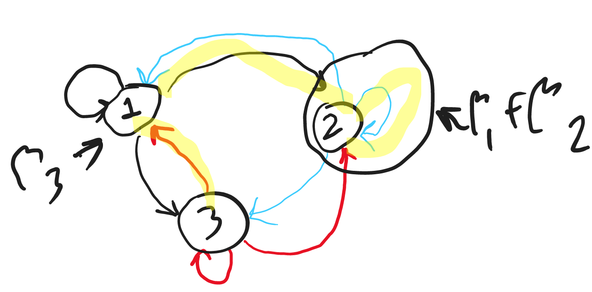

Markov Chain Simulate: Avg. Reward, Expected Present Value
================
Vivek Atal
2023-04-12

- <a href="#markov-chain-simulation"
  id="toc-markov-chain-simulation">Markov chain simulation</a>
  - <a href="#approach" id="toc-approach">Approach</a>
  - <a href="#codes---simulation" id="toc-codes---simulation">Codes -
    simulation</a>
  - <a href="#codes---theoretical" id="toc-codes---theoretical">Codes -
    theoretical</a>

# Markov chain simulation

We are given an MDP with 3 states $S=\{1,2,3\}$. Each state has only one
action, and it can transition to either self or the other two states.
The transition probability matrix is as below, $P_{ij}$ represents
probability of transitioning to state $j$ from state $i$:

$$
P = \begin{bmatrix}
\frac{1}{3} & \frac{1}{3} & \frac{1}{3}\\
0.5 & 0 & 0.5 \\
0 & 0.25 & 0.75
\end{bmatrix}
$$

The rewards for the actions are: $r = \{10,1,5\}$ where $r_i$ is the
reward of taking action from state $i$.

Discount factor is to be considered as $\beta=0.9$. And initial
distribution for calculating expected present value are: $\beta_i=10$
for each state $i$.

We need to calculate the average reward ($g$), and the expected present
value $w(\beta)$.

## Approach

Considering $\beta_i$’s representing the initial number of particles in
state $i$ at time $t=0$. If at time $t=1$ the state is chosen as state
$2$ for the particles who were in state $1$, then all of the $\beta_1$
particles would move together to state $2$ at time $t=1$. Similarly for
other state’s particles $(\beta_2, \beta_3)$.

Idea is to create $3$ simultaneous Markov Chain simulations for each
$\beta_i$’s, and integrate them. For example, if all of
$\beta_1, \beta_2, \beta_3$ at time $t=1$ moves to state $2$, then for
next time the reward would be $(\sum_i\beta_i)*r_2$; and discounted
reward (present value) would be
$\sum_i(\beta_ir_i)_{t=0} + (\sum_i\beta_i)*r_2 * \beta^{t=1}$.

Similarly, if $\beta_1, \beta_2$ at time $t=1$ moves to state $2$ and
$\beta_3$ moves to state $1$, then for next time the reward would be
$( \sum _ {i=1}^2\beta _ i) * r _ 2 + \beta _ 3 * r _ 1$ ; and
discounted reward (present value) would be
$\sum _ i(\beta _ i r _ i) _ {t=0} + [(\sum _ {i=1}^2\beta _ i) * r _ 2 + \beta _ 3 * r _ 1] * \beta^{t=1}$.
A simple pictorial view of this is described below, the yellow
highlighted path is the transition that the $\beta_i$ particles followed
and landed on new state. Black, blue and red paths indicate the
transition possibilities from the respective state.



The above approach is done to generate the Markov Chain for specified
length, and the chain is simulated multiple times as per the simulation
cycle. Finally, the numbers are averaged over simulation cycles to
extract the estimated result.

## Codes - simulation

``` r
set.seed(20)

# State space indices
states <- c(1, 2, 3)

# Action set
# Note this problem has only one action from each state
actions <- c(1)

# Dynamics - transition probability for a given action
# Note this problem has only one action from each state
transition_probability <- matrix(
  c(1/3, 1/3, 1/3,
    0.5, 0, 0.5,
    0, 0.25, 0.75),
  nrow = 3, byrow = TRUE,
  dimnames = list(paste0("from ", states, " action ", actions),
                  paste0("to ", states))
)

# Reward matrix for each state-action
# Note this problem has only one action from each state
reward_matrix <- matrix(
  c(10,
    1,
    5),
  nrow = 3, byrow = TRUE,
  dimnames = list(paste0("state ", states),
                  paste0("action ", actions))
)

# Define simulation path length
path_length <- 5000

# Simulation cycles
sim_cycles <- 100

# Discount factor
beta <- 0.9

# Initial distribution of particles in each state for expected present value
betas <- c(10, 10, 10)

# Initialize total reward to 0
total_reward <- 0

# Initialize state counter to 0 for each state - for EPV, steady state prob.
# how many times we visited each state:
state_counter <- rep(0, length(states))

# Utility function to get the non-missing items from a vector
nonmiss_item <- function(x) {
  return(x[!is.na(x)])
}

# Initialize discounted number of particles for simulation cycle
state_disc_particles_sims <- rep(0, length(states))

# Loop over simulation cycle
for (s in seq_len(sim_cycles)) {
  # Initialize the current state at t0 based on initial distribution of particles
  # Basically, current state of the initial particles x1, x2, x3
  # if initial particle is 0 for a state, then current state for respective x is NA
  current_state <- rep(NA, length(states))
  current_state[betas > 0] <- states[betas > 0]

  # Update state counter for t=0
  # how many times we are in a given state
  state_counter[nonmiss_item(current_state)] <- 
    state_counter[nonmiss_item(current_state)] + 1
  
  # Update rewards tracker for t=0
  # Reward based on current state-action
  # Note this problem has only one action from each state
  reward <- sum(reward_matrix[current_state, 1] * betas, na.rm = TRUE)
  
  # Update total rewards for t=0
  # Update total reward gained so far
  total_reward <- total_reward + reward
  
  # Initialize particles in each state as per initial distribution - for EPV
  state_disc_particles <- betas
  
  # Generate a path of specified length
  for (t in seq_len(path_length)) {
    # Decide next state based on current-state's transition probability vector
    # Note this problem has only one action from each state
    # Missing implies we did not have any particle for respective x_i
    current_state <- sapply(
      current_state,
      function(x) {
        # if x_i's initial distribution was 0 then it cannot belong to any state
        if (is.na(x)) {
          return(NA)
        } else {
          # Refer the transition matrix to find the next state
          return(sample(states, size = 1, prob = transition_probability[x, ]))
        }
      }
    )
    # Note, we may have current_state = {2,2,2} => all x_i's moved to state 2
    
    # Update state counter and discounted particles after transition
    for(i in seq_len(length(current_state))) {
      if (!is.na(current_state[i])) {
        # Update state counter (how many times we are in a given state)
        state_counter[current_state[i]] <- state_counter[current_state[i]] + 1
        
        # Update discounted particles for respective state (rewards
        # will be multiplied later)
        state_disc_particles[current_state[i]] <- 
          state_disc_particles[current_state[i]] + (betas[i] * beta ^ t)
      }
    }
    
    # Reward based on current state-action
    # Note this problem has only one action from each state
    reward <- sum(reward_matrix[current_state, 1] * betas, na.rm = TRUE)

    # Update total reward gained so far
    total_reward <- total_reward + reward
    
  } # markov chain length ends
  
  # Update discounted number of particles across simulation cycles
  state_disc_particles_sims <- state_disc_particles_sims + state_disc_particles
} # simulation cycle ends

# Estimated average reward (per time, per particle)
print(paste0("Average reward: ", total_reward / t / sum(betas) / s))
# Final number of discounted particles based on the initial distribution
state_disc_particles_sims / s
# Total number of discounted particles
sum(state_disc_particles_sims) / s
# Expected present value - discounted particles * respective rewards
print(paste0("Expected present value: ",
             sum(state_disc_particles_sims * reward_matrix[, 1]) / s))
# Estimated steady state probability
print(paste0("Estimated steady state prob: ",
             paste(state_counter / sum(state_counter), collapse = "|")))
```

    ## [1] "Average reward: 4.947008"
    ## [1]  55.25735  65.58836 179.15429
    ## [1] 300
    ## [1] "Expected present value: 1513.93333097127"
    ## [1] "Estimated steady state prob: 0.1575524895021|0.210435912817437|0.632011597680464"

## Codes - theoretical

The theoretical outputs are derived below for the above problem.

``` r
# xx <- matrix(c(
#   1/3-1, .5, 0,
#   1/3, -1, .25,
#   1/3, .5, 0.75-1,
#   1,1,1
# ), byrow = TRUE, nrow = 4)
# yy <- matrix(c(0,0,0,1), nrow = 4)

xx <- rbind(t(transition_probability) - diag(length(states)),
            rep(1, length(states)))
dimnames(xx) <- NULL
yy <- matrix(c(rep(0, length(states)), 1), nrow = length(states) + 1)

# steady state prob
# print(solve(xx[c(1,2,4),], yy[c(1,2,4),]))
print(paste0("Theoretical steady state probs: ",
             paste(
               solve(
                 xx[c(2:length(states), length(states) + 1),],
                 yy[c(2:length(states), length(states) + 1),]
               ),
               collapse = "|"
             )))

# average reward
print(
  paste0(
    "Theoretical average reward: ",
    sum(
      solve(xx[c(2:length(states), length(states) + 1),],
            yy[c(2:length(states), length(states) + 1),]) * reward_matrix[, 1]
    )
  )
)

# ww <- matrix(c(
#   1-beta*1/3, -beta*1/3, -beta*1/3,
#   -beta*0.5, 1-beta*0, -beta*0.5,
#   -beta*0, -beta*0.25, 1-beta*0.75
# ), byrow = TRUE, nrow=3)
# wy <- matrix(betas * c(10,1,5), byrow = TRUE, nrow = 3)

ww <- diag(length(states)) - beta * transition_probability
dimnames(ww) <- NULL
wy <- matrix(betas * reward_matrix[, 1], nrow = length(states))

# expected present value
print(paste0("Theoretical expected present value: ", sum(solve(ww, wy))))
```

    ## [1] "Theoretical steady state probs: 0.157894736842105|0.210526315789474|0.631578947368421"
    ## [1] "Theoretical average reward: 4.94736842105263"
    ## [1] "Theoretical expected present value: 1518.96813353566"
