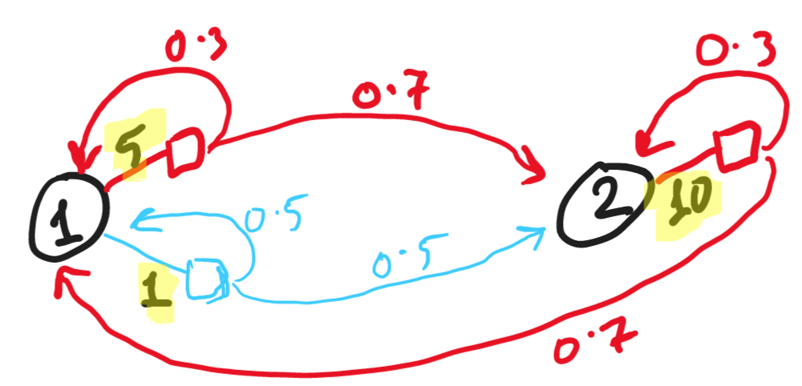
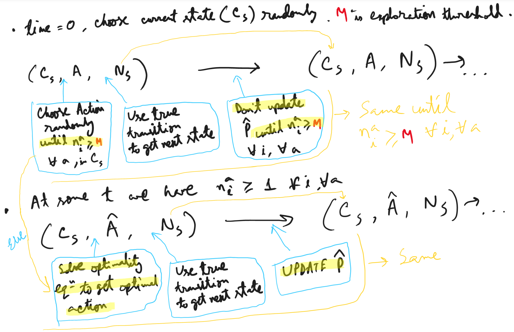
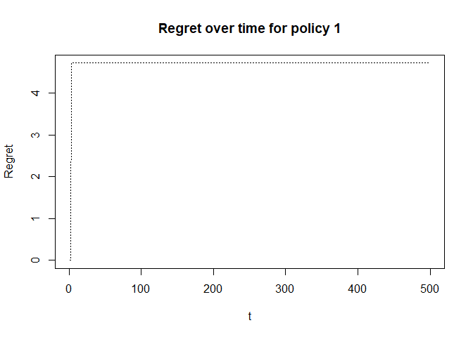
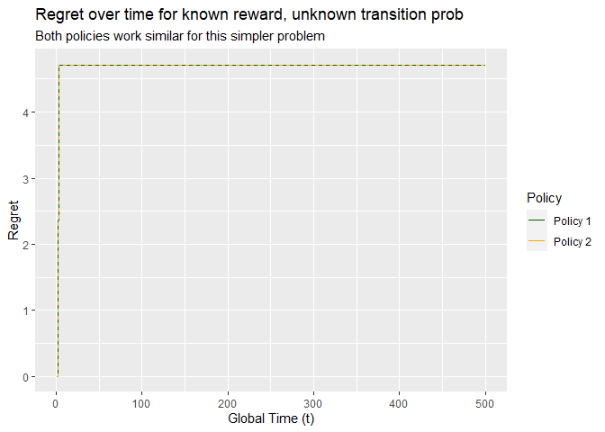
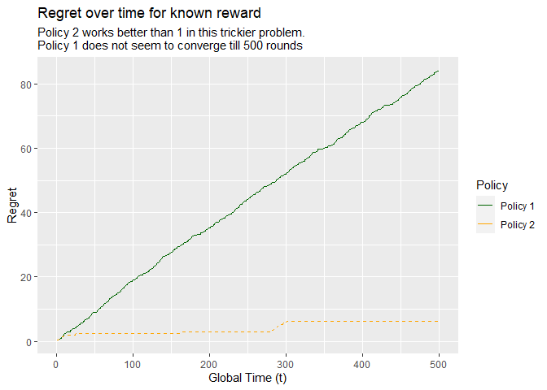

MDP online learning
================
Vivek Atal
2023-04-30

- <a href="#q-learning-simulation"
  id="toc-q-learning-simulation">Q-learning simulation</a>
  - <a href="#codes" id="toc-codes">Codes</a>
    - <a href="#run-simulation" id="toc-run-simulation">Run simulation</a>
    - <a href="#simulation-result" id="toc-simulation-result">Simulation
      result</a>
- <a href="#r-learning-simulation"
  id="toc-r-learning-simulation">R-learning simulation</a>
  - <a href="#codes-1" id="toc-codes-1">Codes</a>
    - <a href="#run-simulation-1" id="toc-run-simulation-1">Run simulation</a>
    - <a href="#simulation-result-1" id="toc-simulation-result-1">Simulation
      result</a>

# Q-learning simulation

Objective here is to learn the optimal policy in an online mode as data
comes one step at a time. Also estimate the transition probability on
the go as well.

Referring to the below MDP (Markov Decision Process) for this simulation
exercise.



Assuming the $P_{i,j}(a)$ are known to nature but not to us. Nature
generates the state transition based on chosen action at each state as
below,

$$
D_t = \{X_0 A_0 X_1, ..., X_{t-1} A_{t-1} X_t\}
$$

which we just observe.

The idea is to use the true transition probability ($P_{i,j}^a$) to
simulate the next state from a given state. However, the action at a
given state is chosen by the algorithm which explores the state-action
for each pair in the initial burn-in stage. And then the algorithm
estimates the transition probability based on the counter of each
state-action pair and how many times it transitioned to which state.
This estimated transition probability ($\hat{P_{i,j}}^a$) is passed on
to the optimality equation to find the discounted value of each state
and the respective optimal action (the `argmax`). Optimality equation
can be solved using successive approximation to compute the optimal
action at time $t$, which is estimated as $\hat{A_t}=\hat{a}$, the
`argmax` of below:

$$
\begin{gather*}
\hat{V}^{(n+1)}(i, t) = \max_{a \in A(i)} \left[r(i,a) + \beta * \sum_j \left(\hat{P_{i,j}}^a(t) * \hat{V}^{(n)}(j, t)\right) \right] \\
\hat{A_t} = argmax_a \left(\hat{V}^{(n+1)}(i, t) \right) = func(r, \beta, \hat{P})
\end{gather*}
$$

Using the identified action by the estimates as above, then we generate
the next state using true transition probability ($P_{i,j}^a$) for the
chosen action at the given state (the nature’s power is used here to
find the next state). Then we again re-estimate $\hat{P_{i,j}}^a$ by
updating the fromState-action-toState counter as
$\frac{n_{i,j}^a(t)}{n_i^{a}(t)}$. And again use the optimality equation
to find the optimal action for the current state using estimated
transition probability as explained in above equation. And again use
nature’s power and update the transition probability estimates, and so
on.

To generate the burn-in stage, we first choose any state at random at
time $t=0$. Then we choose an action relevant for that state randomly
from the pool of actions which had not been chosen yet for the given
state. Also, the initial estimated transition probability is defined to
choose any state uniformly. Once we have taken at least one action from
each state (or more generally, can consider some threshold which could
be \>1), then we use the optimality equation to find the next action,
and keep updating transition probability estimate simultaneously. Note
that the burn-in stage is done for the state where we are currently -
i.e., if all the actions of current state has been explored minimum the
threshold times (irrespective of whether some action of another state
not yet explored), then use optimality equation to solve for optimal
action of that state. This idea is explained in below image:



## Codes

First defining the state, action, rewards, true transition probability,
discount factor (to generate optimal action using discounted value of
each state).

Note, 3-D array is used to store transition probability matrix for each
(action, from state, to state). It is created with a vector as
$P_{1,1}^1, P_{1,1}^2, P_{2,1}^1, P_{2,1}^2, P_{1,2}^1, P_{1,2}^2, P_{2,2}^1, P_{2,2}^2$.
Each superscript is the action id, and subscript indicates (from, to)
state transition. If state 2 has only 1 action then $P_{2,1}^2$ and
$P_{2,2}^2$ would be NA.

``` r
# State space indices
states <- c(1, 2)

# Action set
actions <- c(1, 2)

# Reward matrix for each state-action
rewards <- matrix(
  c(5, 1,
    10, NA),
  nrow = length(states), byrow = TRUE,
  dimnames = list(paste0("state ", states),
                  paste0("action ", actions))
)

# Discount factor
beta <- 0.9

# Create 3-D array to store true transition probability for each action id
# Creating a vector as P_{1,1}^1, P_{1,1}^2, P_{2,1}^1, P_{2,1}^2, P_{1,2}^1,
# P_{1,2}^2, P_{2,2}^1, P_{2,2}^2. Each superscript is the action id, and
# subscript indicates (from, to) state transition. If state 2 has only 1 action
# then P_{2,1}^2 and P_{2,2}^2 would be NA.
# This sequence is used to create an array, so that we can subset [a=1,,] to
# find the transition probability matrix for action 1 from state i to state j.
trans_true <- array(
  c(0.3, 0.5, 0.7, NA, 0.7, 0.5, 0.3, NA),
  dim = c(2, 2, 2), # action, state_from, state_to
  dimnames = list(
    paste0("action ", actions),
    paste0("from ", states),
    paste0("to ", states)
  )
)
# True transition probability matrix for action 1
print("Action 1, true transition")
print(trans_true[1,,])
# True transition probability matrix for action 2
print("Action 2, true transition")
print(trans_true[2,,])

# check for rowsum = 1 in transition probability matrix
stopifnot(all(apply(trans_true, 1, rowSums, na.rm=TRUE) %in% c(1, 0)))
```

    ## [1] "Action 1, true transition"
    ##        to 1 to 2
    ## from 1  0.3  0.7
    ## from 2  0.7  0.3
    ## [1] "Action 2, true transition"
    ##        to 1 to 2
    ## from 1  0.5  0.5
    ## from 2   NA   NA

Defining the function to solve optimality equations using successive
aproximation and find the discounted value of each state and the
respective optimal action.

``` r
#' Solve optimality equations using successive approximation
#'
#' @param beta discount factor, 0 < \code{beta} < 1
#' @param rewards rewards matrix in (state, action) format
#' @param trans transition probability encoded as 3-D array of action,
#'    from state, and to state. \code{trans[1,,]} would reveal transition
#'    probability matrix for action 1.
#' @param eps epsilon for stopping iteration until convergence achieved.
#' @param initial_value vector of initial values for each state, usually 0
#'
#' @return a list having discounted value of states and respective optimal
#'    actions
#'
solve_disc_value <- function(beta, rewards, trans, eps = 1e-6,
                             initial_value = rep(0, dim(trans)[2])) {
  # extract action set indices from transition prob array dimension
  actions <- seq_len(dim(trans)[1])
  # extract state set indices from transition prob array dimension
  states <- seq_len(dim(trans)[2])
  # initialize value of states in next iteration of successive approximation
  next_value <- initial_value
  # initialize optimal action for each state
  opt_action <- rep(NA, length(states))
  # initialize the maximum update between iterations, delta
  delta <- eps * 2
  # Loop to do successive approximation and stop if delta < eps
  while (delta > eps) {
    # get the possible values for each state based on available actions
    # and update next iteration value of state using whichever is higher
    # also find the argmax to set the optimal action for the state
    for (s in states) {
      possible_values <- sapply(
        actions, \(a) rewards[s, a] + beta * sum(trans[a, s, ] * initial_value)
      )
      next_value[s] <- max(possible_values, na.rm = TRUE)
      opt_action[s] <- which.max(possible_values)
    }
    # Recalculate delta
    delta <- max(abs(next_value - initial_value))
    # Reset initial value as per next value
    initial_value <- next_value
  }
  # Return the discounted value after it stabilizes, and final optimal actions
  return(list(disc_value = next_value, opt_action = opt_action))
}
```

### Run simulation

Now define the learning algorithm using the logic as explained earlier.

``` r
set.seed(20)

# Define simulation path length
path_length <- 500

# Define minimum number of times to take an action in a state before estimating
# optimality equation with that. To increase exploration time.
min_n_state_act_thrsh <- 1

# Initialize all required variables - current time, value of state, optimal
# action of state, transition probability estimate (to be used in value calc),
# counter of (from, to, action) and (from, action)
t <- 0
# transition prob estimate initialized as equal prob to visit any state
trans_hat <- trans_true
trans_hat[seq_along(trans_hat)] <- 1/length(states)
# counter of (from, to, action): n_{i,j}^a, initialized at 0 if trans prob
# is not missing, else NA. To enforce the counter tracks correctly.
# Here we are assuming we know the structure of the MDP, but not the transitiion
# probabilities
n_from_act_to <- trans_true
n_from_act_to[!is.na(n_from_act_to)] <- 0
# counter of (from, action): n_i^a = \sum_j n_{i,j}^a, initialized at 0
# make sure to set the counter to NA if a state does not have a given action
n_from_act <- apply(n_from_act_to, c(1, 2), sum, na.rm = TRUE)
n_from_act[is.na(t(rewards))] <- NA # dim of transpose of rewards matches

# Choose current state at t=0 randomly
current_state <- sample(states, 1)

for (t in seq_len(path_length)) {
  # minimum of $n_i^a$, if >= threshold then solve optimality eq to choose
  # action, else randomly. Note that this check is defined on selected state
  min_n_state_act <- min(n_from_act[, current_state], na.rm = TRUE)
  if (min_n_state_act < min_n_state_act_thrsh) {
    # choose action for current state randomly not yet drawn min threshold times
    chosen_action <- sample(
      which(n_from_act[, current_state] < min_n_state_act_thrsh),
      size = 1
    )
  } else {
    # solve optimality equation
    opt_sol <- solve_disc_value(beta, rewards, trans_hat)
    # get the estimated best action for current state
    chosen_action <- opt_sol$opt_action[current_state]
  }
  # identify next state based on true trans prob (nature's power!)
  nature_power <- trans_true[chosen_action, current_state, ]
  nature_power[is.na(nature_power)] <- 0
  next_state <- sample(
    states, size = 1,
    prob = nature_power
  )
  # Update state action transition counter $n_{i,j}^a$
  n_from_act_to[chosen_action, current_state, next_state] <-
    n_from_act_to[chosen_action, current_state, next_state] + 1
  # Recalculate $n_i^a$ which is $sum_j(n_{i,j}^a)$
  # counter of (from, action)
  # make sure to set the counter to NA if a state does not have a given action
  n_from_act <- apply(n_from_act_to, c(1, 2), sum, na.rm = TRUE)
  n_from_act[is.na(t(rewards))] <- NA # dim of transpose of rewards matches
  
  # minimum of $n_i^a$, if >=thres then update estimate of transition prob, else
  # don't. Note that this is defined for all state, all actions
  min_n_state_act <- min(n_from_act, na.rm = TRUE)
  # Update estimated transition prob if all $n_i^a >= threshold$, else pass
  if (min_n_state_act >= min_n_state_act_thrsh) {
    # Update transition probability estimate based on
    # counters: n_{i,j}^a / n_i^a
    for (a in actions){
      trans_hat[a,,] <- n_from_act_to[a,,]/n_from_act[a,]
    }
  }
  # Reset current state to next state
  current_state <- next_state
}
```

### Simulation result

Now let’s check the estimated transition probability and compare that
with the true one.

``` r
# Action 1
print("Action 1, estimated")
print(trans_hat[1,,])
print("Action 1, true")
print(trans_true[1,,])

# Action 2
print("Action 2, estimated")
print(trans_hat[2,,])
print("Action 2, true")
print(trans_true[2,,])
```

    ## [1] "Action 1, estimated"
    ##             to 1      to 2
    ## from 1 0.3172691 0.6827309
    ## from 2 0.6800000 0.3200000
    ## [1] "Action 1, true"
    ##        to 1 to 2
    ## from 1  0.3  0.7
    ## from 2  0.7  0.3
    ## [1] "Action 2, estimated"
    ##        to 1 to 2
    ## from 1    1    0
    ## from 2   NA   NA
    ## [1] "Action 2, true"
    ##        to 1 to 2
    ## from 1  0.5  0.5
    ## from 2   NA   NA

And the estimated optimal policy identified in the end of the
simulations is,

``` r
print("Estimated optimal policy and discounted value")
opt_sol
```

    ## [1] "Estimated optimal policy and discounted value"
    ## $disc_value
    ## [1] 73.13828 76.91099
    ## 
    ## $opt_action
    ## [1] 1 1

and the true optimal policy is,

``` r
print("True optimal policy and discounted value")
solve_disc_value(beta, rewards, trans_true)
```

    ## [1] "True optimal policy and discounted value"
    ## $disc_value
    ## [1] 73.16176 76.83823
    ## 
    ## $opt_action
    ## [1] 1 1

# R-learning simulation

We are solving the similar problem as above with the exact same MDP, now
with R-learning instead of Q-learning.

Instead of using discounted reward, now we will use average reward of
each state as the optimality equation to find the optimal action for
each state. So, we don’t really need the discount factor anymore.

Also, we will solve the average reward optimality equations using LP
primal instead of successive approximation this time.

The algorithm for this simulation is exactly same except the above
differences in optimality equation (forming it and solving it).

Objective here is to learn the optimal policy in an online mode as data
comes one step at a time. Also estimate the transition probability on
the go as well and derive the regret.

Referring to the below MDP (Markov Decision Process) for this simulation
exercise.


Assuming the $P_{i,j}(a)$ are known to nature but not to us. Nature
generates the state transition based on chosen action at each state as
below,

$$
D_t = \{X_0 A_0 X_1, ..., X_{t-1} A_{t-1} X_t\}
$$

which we just observe.

The idea is to use the true transition probability ($P_{i,j}^a$) to
simulate the next state from a given state. However, the action at a
given state is chosen by the algorithm which explores the state-action
for each pair in the initial burn-in stage. And then the algorithm
estimates the transition probability based on the counter of each
state-action pair and how many times it transitioned to which state.
This estimated transition probability ($\hat{P_{i,j}}^a$) is passed on
to the optimality equation to find the average reward and the respective
optimal action (the `argmax`) of each state. Optimality equation can be
solved using linear programming to compute the optimal action at time
$t$, which is estimated as $\hat{A_t}=\hat{a}$: for the given state,
whichever constraint attains equality in below LP formulation:

$$
\min{\phi}  \\\  
\text{subject to: } 
\phi + V _ X = \max _ {a \in A(X)} \left[ r(X,a) + \sum_Y \hat{P}_{X,Y}(a) V_Y \right] 
\text{, }\forall{X} \\\  
\text{similar as: }\phi + V_X \ge \left[ r(X,a) + \sum_Y \hat{P}_{X,Y}(a) V_Y \right] 
\text{, } \forall a \in A(X) \text{, } \forall{X} \\\  
V_X \text{ can be free variable, BUT we will use constraint } \sum_X V_X = 0 \text{ for unique solution} \\\  
\hat{a}(X) = argmax_a(\hat{\phi} + \hat{V_X}) = func(r, \hat{P}) \text{, whichever action attains equality in constraints for given } X  
$$

**Two ways to find optimal actions** to be employed instead of just the
above approach; one approach is same as above, and the other approach is
to include another component while doing $argmax$. Both the approaches
are again detailed below:

- First, solve the optimality equations using LP as per the above
  formulation of the problem. So, when in state $X$ at golbal time $t$,
  we get $\hat{\phi^t}$ & $\hat{V_X^t}$ by solving the optimality
  equations $OPT(r(X), \hat{P^t})$ as above.
- **Policy-1**
  - Choose the optimal action for state $X$ at global time $t$ as below,

$$
\hat{a}(t,X) = argmax _ {a \in A(X)} \left( r(X,a) + \sum_Y \hat{P}^t _ {X,Y}(a) \hat{V _ Y^t}  \right )
$$

- **Policy-2**
  - Choose the optimal action for state $X$ at global time $t$ as below,

$$
\hat{a}(t,X) = argmax_{a \in A(X)}\left(r(X,a) + \sum_Y \hat{P}^t_{X,Y}(a) \hat{V_Y^t} + \sqrt{\frac{2log(t)}{N^i_a(t)}} \right)
$$

where $T_{X,a}(t) \equiv N^i_a(t)$, these are equivalent notations.

Using the identified action by the estimates as above, then we generate
the next state using true transition probability ($P_{i,j}^a$) for the
chosen action at the given state (the nature’s power is used here to
find the next state). Then we again re-estimate $\hat{P_{i,j}}^a$ by
updating the fromState-action-toState counter as
$\frac{n_{i,j}^a(t)}{n_i^{a}(t)}$. And again use the optimality equation
to find the optimal action for the current state using estimated
transition probability as explained in above equation. And again use
nature’s power and update the transition probability estimates, and so
on.

To generate the burn-in stage, we first choose any state at random at
time $t=0$. Then we choose an action relevant for that state randomly
from the pool of actions which had not been chosen yet for the given
state. Also, the initial estimated transition probability is defined to
choose any state uniformly. Once we have taken at least one action from
each state (or more generally, can consider some threshold which could
be \>1), then we use the optimality equation to find the next action,
and keep updating transition probability estimate simultaneously. Note
that the burn-in stage is done for the state where we are currently -
i.e., if all the actions of current state has been explored minimum the
threshold times (irrespective of whether some action of another state
not yet explored), then use optimality equation to solve for optimal
action of that state. This idea is explained in below image:


**Regret** values are generated following the below approach:

- Derive L-value for the *optimal action* in state $X$ as per *true
  transition probability* as
  $L \left( X, \pi^ * , P _ X(\pi^ * ) \right ) = r(X, a^ * ) + \sum _ Y P _ {XY}(a^ * )V^ * _ Y$;
  where $V^*$ values are extracted after solving the optimality
  equations using the true transition probability.

- Similarly, derive the L-value for the *optimal action* in state $X$ as
  per the *estimated transition probability* generated using the
  policies as explained above.

  - Note that, we still **use the same L-values derived** by solving
    optimality equation with **true transition probability**, but
    **fetch** the value for the **chosen action as per the policy**. The
    policy uses the estimated transition probability in the backend to
    choose the optimal action at time $t$.

- For the current state and the chosen action per a policy $\pi^0$,
  define the delta value as
  $\Delta(X, \pi^0) = L \left ( X, \pi^ * , P _ X(\pi^ * ) \right ) - L \left ( X, \pi^0, P _ X(\pi^0) \right )$
  .

- Finally, the `Regret` is to be calculated as cumulative sum of the
  delta values as we keep moving forward in time. Which is same as
  multiplying the delta values with the number of times the respective
  state-action pair was chosen, and sum over all states-actions.

$$
R_{\pi^0}(t) = \sum_X \sum_{a \in A(X)} \Delta(X, a) T_{X,a}(t) \text{, action chosen as per }\pi^0
$$

Note that,

$$
\Delta(X, a) = \begin{cases}
0 & \text{if } a = \pi^ * (X) \\  
\gt 0 & \text{if } a \ne \pi^ * (X)
\end{cases}
$$

## Codes

First defining the state, action, rewards, true transition probability.

Note, 3-D array is used to store transition probability matrix for each
(action, from state, to state). It is created with a vector as
$P_{1,1}^1, P_{1,1}^2, P_{2,1}^1, P_{2,1}^2, P_{1,2}^1, P_{1,2}^2, P_{2,2}^1, P_{2,2}^2$.
Each superscript is the action id, and subscript indicates (from, to)
state transition. If state 2 has only 1 action then $P_{2,1}^2$ and
$P_{2,2}^2$ would be NA.

``` r
# State space indices
states <- c(1, 2)

# Action set
actions <- c(1, 2)

# Reward matrix for each state-action
rewards <- matrix(
  c(5, 1,
    10, NA),
  nrow = length(states), byrow = TRUE,
  dimnames = list(paste0("state ", states),
                  paste0("action ", actions))
)

# Create 3-D array to store true transition probability for each action id
# Creating a vector as P_{1,1}^1, P_{1,1}^2, P_{2,1}^1, P_{2,1}^2, P_{1,2}^1,
# P_{1,2}^2, P_{2,2}^1, P_{2,2}^2. Each superscript is the action id, and
# subscript indicates (from, to) state transition. If state 2 has only 1 action
# then P_{2,1}^2 and P_{2,2}^2 would be NA.
# This sequence is used to create an array, so that we can subset [a=1,,] to
# find the transition probability matrix for action 1 from state i to state j.
trans_true <- array(
  c(0.3, 0.5, 0.7, NA, 0.7, 0.5, 0.3, NA),
  dim = c(2, 2, 2), # action, state_from, state_to
  dimnames = list(
    paste0("action ", actions),
    paste0("from ", states),
    paste0("to ", states)
  )
)
# True transition probability matrix for action 1
print("Action 1, true transition")
print(trans_true[1,,])
# True transition probability matrix for action 2
print("Action 2, true transition")
print(trans_true[2,,])

# check for rowsum = 1 in transition probability matrix
stopifnot(all(apply(trans_true, 1, rowSums, na.rm=TRUE) %in% c(1, 0)))
```

    ## [1] "Action 1, true transition"
    ##        to 1 to 2
    ## from 1  0.3  0.7
    ## from 2  0.7  0.3
    ## [1] "Action 2, true transition"
    ##        to 1 to 2
    ## from 1  0.5  0.5
    ## from 2   NA   NA

Defining the function to solve optimality equations using linear
programming and find the average reward and the optimal action of each
state.

``` r
# Using CVXR library for solving the LP optimization
if(!require("CVXR", character.only = TRUE, quietly = TRUE)) {
  install.packages(x)
  require(x, character.only = TRUE)
}

#' Solve optimality equations using linear programming
#' 
#' Constructing the optimization constraints in the same way as described in the
#' mathematical formulation above. The codes to do that may not be very easy to
#' understand, but the idea is to use matrix formulation and matrix
#' multiplication to set the desired constraints - so that the same function
#' can work irrespective of the size of MDP dynamics (states, actions).
#'
#' @param rewards rewards matrix in (state, action) format
#' @param trans transition probability encoded as 3-D array of action,
#'    from state, and to state. \code{trans[1,,]} would reveal transition
#'    probability matrix for action 1.
#' @param policy the policy id number as per the above theoretical formulation.
#' @param n_from_act current counter of n_i^a (rows: actions, columns: states).
#'    Note that this is based on history.
#'    \code{sum(n_from_act)} would be the global time and
#'    \code{n_from_act[action_to_choose, from_state]} to be the counter of
#'    action_to_choose from from_state if that action is chosen as optimal.
#'
#' @return a list having average reward value and optimal actions for each state
#'

solve_avg_reward <- function(rewards, trans, policy = 1, n_from_act = NULL) {
  # extract action set indices from transition prob array dimension
  actions <- seq_len(dim(trans)[1])
  # extract state set indices from transition prob array dimension
  states <- seq_len(dim(trans)[2])
  # Setting missing values in transition prob, rewards matrix to 0
  # They were missing because those state-action pair don't exist
  # For optimization we are setting them to 0 so that they won't contribute
  trans_zeromiss <- trans
  trans_zeromiss[is.na(trans_zeromiss)] <- 0
  rewards_zeromiss <- rewards
  rewards_zeromiss[is.na(rewards_zeromiss)] <- 0
  # n_from_act_zeromiss <- n_from_act
  # n_from_act_zeromiss[is.na(n_from_act_zeromiss)] <- 0
  if (length(n_from_act) == 0) {
    n_from_act <- 0
  }
  
  # global time
  global_t <- sum(n_from_act, na.rm = TRUE)
  
  # decision variable representing V_X (or h_i), for each state
  v_x <- Variable(length(states))
  # decision variable representing average reward of the MDP, \phi (or g)
  phi <- Variable(1)

  # Set of inequality constraints defined using matrix multiplication.
  # If there are two actions in state 1 then there would be two inequalities
  # as phi+v_1 >= f(r_a1, trans_a1) and phi+v_1 >= f(r_a2, trans_a2).
  # Using Kronecker product of matrices, collapsing 3-D array to matrix, etc.
  # Idea is to convert the equations as a column vector whose row indices are
  # (state_1, act_1), (state_1, act_2), (state_1, act_3), (state_2, act_1),
  # (state_2, act_2), (state_2, act_3), ...
  c1 <- phi + diag(length(states)) %x% rep(1, length(actions)) %*% v_x >= 
    as.vector(t(rewards_zeromiss)) +
    apply(trans_zeromiss, 3, rbind) %*% v_x
  
  # sum(V_X) = 0
  c2 <- sum(v_x) == 0
  
  # The optimization problem of minimizing \phi s.t. the constraints
  p <- Problem(Minimize(phi), list(c1, c2))
  # check if the specification conforms to CVXR requirement
  is_dcp(p)
  # solve the optimization problem
  s <- solve(p)
  # check the status of optimization solution
  s$status
  # average reward
  avg_reward <- s$value
  
  # non-zero duals mean those constraints attain equality in primal in this case
  # convert it to matrix form, rows represent actions, columns represent states
  nonzero_duals <- (s$getValue(c1) != 0) |>
    matrix(nrow=length(actions))
  # which action is optimal in each state - extract vector of optimal
  # action id of each state (which index of action is true for given state).
  # If there are multiple actions in a state then pick the first one.
  # Note that this will return NA if there are no action attaining equality
  #   for a state, which should not happen as per the math behind.
  opt_action <- apply(nonzero_duals, 2, which, simplify = FALSE) |>
    sapply(\(x) x[1])
  
  # Below ANOTHER WAY to find OPTIMAL ACTION. ABOVE approach not being used.
  # Optimal action to be chosen based on the policy NOW:
  # below vectors are in this sequence: state1-act1, state1-act2, state2-act-1
  # state2-act2, state3-act1, state3-act2, ...
  reward_state_action <- as.vector(t(rewards_zeromiss))
  trans_v_state_action <- apply(trans_zeromiss, 3, rbind) %*% s$getValue(v_x)
  # the optimal one - only one of those actions will be chosen as optimal
  loc_counter_state_action <- as.vector(n_from_act)
  # constructing argmax input for state-action based on policy
  if (policy == 1) {
    argmax_input <- reward_state_action + trans_v_state_action
  } else if (policy == 2) {
    if (global_t == 0) {
      argmax_input <- reward_state_action + trans_v_state_action
    } else {
      argmax_input <- reward_state_action + trans_v_state_action +
        sqrt(2 * log(global_t) / loc_counter_state_action)
    }
  }
  # Identify optimal action id for each state by restructuring argmax input
  opt_action <- argmax_input |>
    # cols to be states, rows to be actions
    array(dim = c(length(actions), length(states))) |>
    # find argmax for each column
    apply(2, which.max)
  
  # L values: to be used for regret calculation
  L_values <- (reward_state_action + trans_v_state_action) |>
    # cols to be states, rows to be actions
    array(dim = c(length(actions), length(states)))
    
  # Return the average reward, final optimal actions of each state, and v_x
  # Also return the L-values as matrix (cols: states, rows: actions)
  return(list(
    avg_reward = avg_reward,
    opt_action = opt_action,
    v_x = s$getValue(v_x),
    L_values = L_values
  ))
  
}
```

### Run simulation

Now define the learning algorithm using the logic as explained earlier.

``` r
#' Simulate regret and find optimal policy
#' 
#' Unknown transition probability, known reward
#'
#' @param path_length How long to simulate (global time limit)
#' @param min_n_state_act_thrsh minimum number times to take an action in a
#'    state before estimating optimality equation with that. Exploration phase.
#' @param trans_true true transition probability, for simulation purpose
#' @param states state indices
#' @param rewards rewards matrix (col: actions, row: states)
#' @param policy policy id to use
#'
#' @return list of transition probability estimated, optimality equation
#'    solution using the est. transition prob, and regret sequence over time.
#'    
simulate_regret <- function(path_length, min_n_state_act_thrsh = 1,
                            trans_true, states, rewards, policy = 1) {
  # Avg reward, V and L values based on true transition probability
  optimal_sol_true <- solve_avg_reward(rewards, trans_true)
  # true optimal action for each state
  opt_action_true <- optimal_sol_true$opt_action
  # Regret array̥ initialize
  regret <- c()

  # Initialize all required variables - current time, value of state, optimal
  # action of state, transition probability estimate (to be used in value calc),
  # counter of (from, to, action) and (from, action)
  t <- 0
  # transition prob estimate initialized as equal prob to visit any state
  trans_hat <- trans_true
  trans_hat[seq_along(trans_hat)] <- 1/length(states)
  # counter of (from, to, action): n_{i,j}^a, initialized at 0 if trans prob
  # is not missing, else NA. To enforce the counter tracks correctly.
  # Here we are assuming we know the structure of the MDP, but not the transitiion
  # probabilities
  n_from_act_to <- trans_true
  n_from_act_to[!is.na(n_from_act_to)] <- 0
  # counter of (from, action): n_i^a = \sum_j n_{i,j}^a, initialized at 0
  # make sure to set the counter to NA if a state does not have a given action
  n_from_act <- apply(n_from_act_to, c(1, 2), sum, na.rm = TRUE)
  n_from_act[is.na(t(rewards))] <- NA # dim of transpose of rewards matches
  
  # Choose current state at t=0 randomly
  current_state <- sample(states, 1)
  
  for (t in seq_len(path_length)) {
    # minimum of $n_i^a$, if >= threshold then solve optimality eq to choose
    # action, else randomly. Note that this check is defined on selected state
    min_n_state_act <- min(n_from_act[, current_state], na.rm = TRUE)
    if (min_n_state_act < min_n_state_act_thrsh) {
      # choose action for current state randomly not yet drawn min threshold times
      chosen_action <- sample(
        which(n_from_act[, current_state] < min_n_state_act_thrsh),
        size = 1
      )
    } else {
      # solve optimality equation
      opt_sol <- solve_avg_reward(rewards, trans_hat, policy, n_from_act)
      # get the estimated best action for current state
      chosen_action <- opt_sol$opt_action[current_state]
    }
    # update regret (difference of L-value of true optimal action at current
    #  state, and chosen action per policy at current state at current time)
    regret <- c(
      regret,
      optimal_sol_true$L_values[
        opt_action_true[current_state], current_state
      ] - optimal_sol_true$L_values[chosen_action, current_state]
    )
    
    # identify next state based on true trans prob (nature's power!)
    nature_power <- trans_true[chosen_action, current_state, ]
    nature_power[is.na(nature_power)] <- 0
    next_state <- sample(
      states, size = 1,
      prob = nature_power
    )
    # Update state action transition counter $n_{i,j}^a$
    n_from_act_to[chosen_action, current_state, next_state] <-
      n_from_act_to[chosen_action, current_state, next_state] + 1
    # Recalculate $n_i^a$ which is $sum_j(n_{i,j}^a)$
    # counter of (from, action)
    # make sure to set the counter to NA if a state does not have a given action
    n_from_act <- apply(n_from_act_to, c(1, 2), sum, na.rm = TRUE)
    n_from_act[is.na(t(rewards))] <- NA # dim of transpose of rewards matches
    # minimum of $n_i^a$, if >=thres then update estimate of transition prob, else
    # don't. Note that this is defined for all state, all actions
    min_n_state_act <- min(n_from_act, na.rm = TRUE)
    # Update estimated transition prob if all $n_i^a >= threshold$, else pass
    if (min_n_state_act >= min_n_state_act_thrsh) {
      # Update transition probability estimate based on
      # counters: n_{i,j}^a / n_i^a
      for (a in actions){
        trans_hat[a,,] <- n_from_act_to[a,,]/n_from_act[a,]
      }
    }
    # Reset current state to next state
    current_state <- next_state
  }
  # Return the estimated transition prob (P^hat), avg reward based on P^hat,
  # and regret sequence over time (cumulative sum)
  return(list(
    trans_hat = trans_hat,
    est_opt_sol = opt_sol,
    regret = cumsum(regret)
  ))
  
}
```

### Simulation result

#### Policy 1

**Run simulation** using policy 1.

``` r
# set random seed
set.seed(20)

# Define simulation path length
path_length <- 500

# Define minimum number of times to take an action in a state before estimating
# optimality equation with that. To increase exploration time.
min_n_state_act_thrsh <- 1

# get results
sim_p1 <- simulate_regret(path_length, min_n_state_act_thrsh,
                          trans_true, states, rewards, policy = 1)
```

Now let’s check the **estimated transition probability** and compare
that with the true one.

``` r
# Action 1
print("Action 1, estimated")
print(sim_p1$trans_hat[1,,])
print("Action 1, true")
print(trans_true[1,,])

# Action 2
print("Action 2, estimated")
print(sim_p1$trans_hat[2,,])
print("Action 2, true")
print(trans_true[2,,])
```

    ## [1] "Action 1, estimated"
    ##             to 1      to 2
    ## from 1 0.3293651 0.6706349
    ## from 2 0.6842105 0.3157895
    ## [1] "Action 1, true"
    ##        to 1 to 2
    ## from 1  0.3  0.7
    ## from 2  0.7  0.3
    ## [1] "Action 2, estimated"
    ##        to 1 to 2
    ## from 1    1    0
    ## from 2   NA   NA
    ## [1] "Action 2, true"
    ##        to 1 to 2
    ## from 1  0.5  0.5
    ## from 2   NA   NA

And the **estimated optimal policy** identified in the end of the
simulations is,

``` r
print("Estimated optimal policy and average reward")
sim_p1$est_opt_sol
```

    ## [1] "Estimated optimal policy and average reward"
    ## $avg_reward
    ## [1] 7.477297
    ## 
    ## $opt_action
    ## [1] 1 1
    ## 
    ## $v_x
    ##           [,1]
    ## [1,] -1.846979
    ## [2,]  1.846979
    ## 
    ## $L_values
    ##            [,1]     [,2]
    ## [1,]  5.6303182 9.324276
    ## [2,] -0.8469789 0.000000

and the **true optimal policy** is,

``` r
print("True optimal policy and average reward")
solve_avg_reward(rewards, trans_true)
```

    ## [1] "True optimal policy and average reward"
    ## $avg_reward
    ## [1] 7.5
    ## 
    ## $opt_action
    ## [1] 1 1
    ## 
    ## $v_x
    ##           [,1]
    ## [1,] -1.785714
    ## [2,]  1.785714
    ## 
    ## $L_values
    ##          [,1]     [,2]
    ## [1,] 5.714286 9.285714
    ## [2,] 1.000000 0.000000

**Regret over time** of choosing action driven by the policy.

``` r
plot(sim_p1$regret, type = "l", lty = 3,
     main = "Regret over time for policy 1",
     xlab = "t", ylab = "Regret")
```

<!-- -->

#### Policy 2

**Run simulation** using policy 2.

``` r
# set random seed
set.seed(20)

# Define simulation path length
path_length <- 500

# Define minimum number of times to take an action in a state before estimating
# optimality equation with that. To increase exploration time.
min_n_state_act_thrsh <- 1

# get results
sim_p2 <- simulate_regret(path_length, min_n_state_act_thrsh,
                          trans_true, states, rewards, policy = 2)
```

Now let’s check the **estimated transition probability** and compare
that with the true one.

``` r
# Action 1
print("Action 1, estimated")
print(sim_p2$trans_hat[1,,])
print("Action 1, true")
print(trans_true[1,,])

# Action 2
print("Action 2, estimated")
print(sim_p2$trans_hat[2,,])
print("Action 2, true")
print(trans_true[2,,])
```

    ## [1] "Action 1, estimated"
    ##             to 1      to 2
    ## from 1 0.3293651 0.6706349
    ## from 2 0.6842105 0.3157895
    ## [1] "Action 1, true"
    ##        to 1 to 2
    ## from 1  0.3  0.7
    ## from 2  0.7  0.3
    ## [1] "Action 2, estimated"
    ##        to 1 to 2
    ## from 1    1    0
    ## from 2   NA   NA
    ## [1] "Action 2, true"
    ##        to 1 to 2
    ## from 1  0.5  0.5
    ## from 2   NA   NA

And the **estimated optimal policy** identified in the end of the
simulations is,

``` r
print("Estimated optimal policy and average reward")
sim_p2$est_opt_sol
```

    ## [1] "Estimated optimal policy and average reward"
    ## $avg_reward
    ## [1] 7.477297
    ## 
    ## $opt_action
    ## [1] 1 1
    ## 
    ## $v_x
    ##           [,1]
    ## [1,] -1.846979
    ## [2,]  1.846979
    ## 
    ## $L_values
    ##            [,1]     [,2]
    ## [1,]  5.6303182 9.324276
    ## [2,] -0.8469789 0.000000

and the **true optimal policy** is,

``` r
print("True optimal policy and average reward")
solve_avg_reward(rewards, trans_true)
```

    ## [1] "True optimal policy and average reward"
    ## $avg_reward
    ## [1] 7.5
    ## 
    ## $opt_action
    ## [1] 1 1
    ## 
    ## $v_x
    ##           [,1]
    ## [1,] -1.785714
    ## [2,]  1.785714
    ## 
    ## $L_values
    ##          [,1]     [,2]
    ## [1,] 5.714286 9.285714
    ## [2,] 1.000000 0.000000

**Regret over time** of choosing action driven by the policy.

``` r
plot(sim_p2$regret, type = "l", lty = 3,
     main = "Regret over time for policy 2",
     xlab = "t", ylab = "Regret")
```

<!-- -->

#### Compare policies

Let us plot the regret of both policies on same graph to be able to
compare the performance of the policies.

``` r
require(ggplot2)
ggplot(mapping = aes(x = seq_len(path_length))) +
  geom_line(aes(y = sim_p1$regret,
                color = "Policy 1")) +
  geom_line(aes(y = sim_p2$regret,
                color = "Policy 2"), linetype = "dashed") +
  scale_color_manual(
    name = "Policy",
    values = c("Policy 1" = "darkgreen",
               "Policy 2" = "orange")
  ) +
  labs(
    x = "Global Time (t)", y = "Regret",
    title = "Regret over time for known reward, unknown transition prob",
    subtitle = paste0("Both policies work similar for this simpler problem")
  )
```

<!-- -->

#### Increase complexity

Making the problem a bit complex so that we can see some variation in
the output of both the policies. Increasing the reward of action 2 of
state 1 would do it.

And then we again simulate this modified MDP with both the policies, and
compare the regret over time.

``` r
# Reward matrix for each state-action - MODIFIED
rewards_tricky <- matrix(
  c(5, 6,
    10, NA),
  nrow = length(states), byrow = TRUE,
  dimnames = list(paste0("state ", states),
                  paste0("action ", actions))
)

# set random seed
set.seed(20)

# Define simulation path length
path_length <- 500

# get results for policy 1
sim_p1_tricky <- simulate_regret(path_length, min_n_state_act_thrsh,
                          trans_true, states, rewards_tricky, policy = 1)
# get results for policy 2
sim_p2_tricky <- simulate_regret(path_length, min_n_state_act_thrsh,
                          trans_true, states, rewards_tricky, policy = 2)

# compare the regret
ggplot(mapping = aes(x = seq_len(path_length))) +
  geom_line(aes(y = sim_p1_tricky$regret,
                color = "Policy 1")) +
  geom_line(aes(y = sim_p2_tricky$regret,
                color = "Policy 2"), linetype = "dashed") +
  scale_color_manual(
    name = "Policy",
    values = c("Policy 1" = "darkgreen",
               "Policy 2" = "orange")
  ) +
  labs(
    x = "Global Time (t)", y = "Regret",
    title = "Regret over time for known reward",
    subtitle = paste0("Policy 2 works better than 1 in this trickier problem. ",
                      "\nPolicy 1 does not seem to converge till ",
                      path_length, " rounds")
  )
```

<!-- -->
