Time Series - Store Sales Forecasting
================
Vivek Atal
2023-05-01

- <a href="#overview" id="toc-overview">Overview</a>
- <a href="#aproach" id="toc-aproach">Aproach</a>
- <a href="#data-exploration" id="toc-data-exploration">Data
  exploration</a>
  - <a href="#high-level-summary" id="toc-high-level-summary"><strong>High
    level summary</strong></a>
  - <a href="#data-processing" id="toc-data-processing">Data processing</a>
  - <a href="#summaries--visuals" id="toc-summaries--visuals">Summaries
    &amp; visuals</a>
  - <a href="#additional-cleaning--features"
    id="toc-additional-cleaning--features">Additional cleaning &amp;
    features</a>
  - <a href="#naive-approach-for-causal-relation"
    id="toc-naive-approach-for-causal-relation">Naive approach for causal
    relation</a>
- <a href="#analysing-biggest-store-family"
  id="toc-analysing-biggest-store-family">Analysing biggest
  store-family</a>
  - <a href="#manual-model-tuning" id="toc-manual-model-tuning">Manual model
    tuning</a>
  - <a href="#cross-validation" id="toc-cross-validation">Cross
    validation</a>
- <a href="#autoarima-benchmarking"
  id="toc-autoarima-benchmarking"><code>auto.arima</code> benchmarking</a>
- <a href="#next-steps" id="toc-next-steps">Next steps</a>

## Overview

- [Grocery Store
  Sales](https://www.kaggle.com/competitions/store-sales-time-series-forecasting/)
  data is sourced from Kaggle.
- It contains store level and product family level daily sales data from
  a retail company based out of Ecuador.
  - And also some supplemental data on daily oil prices, number of
    products on promotion for a given product family, holiday/events,
    information on payday and a major earthquake.
- The **business problem** is to forecast the daily sales till \~2-weeks
  ahead of time (16 days to be precise) at store and product family
  level.
  - That will help the store manager to adequately plan for
    replenishment of stock and minimize loss of perishable products.
  - Also one of the objective is to estimate short-term impact of
    promotion to influence sales as there is some promotion information
    present in the data.

## Aproach

**Data Exploration**

- Some summaries are created and some dimensions are visualized to
  understand the data granularity and how the data is distributed
- Some irregularities are identified while exploring - which may be
  controlled by using additional dummy variables. E.g., earthquake
  impact (there are events indicating earthquake in the events data);
  data capturing issue on 1st January of every year, etc.

**Find causal relationships**

- Macro-economic data on oil prices are provided which may help
  improving the predictive power.
- Analyze each store’s sales and see if there are any causal
  relationship. For example, if some product is out of stock in a store,
  then the nearby store’s sales of that product might increase.

**Evaluation**

- Rolling forecast to be done to evaluate performance of a model.
- Root mean squared log error (RMSLE) metric will be used measure
  goodness of the model.

**Modeling technique**

- Seasonal ARIMA with regressors to be explored as one option.
- Structural additive decomposing with `stl` function to deseasonalize,
  and then use `auto.arima` to fit non-seasonal ARIMA model. This may
  serve as the baseline model.
- Additional modeling techniques such as DeepAR to be explored as well.

## Data exploration

**Following data files are provided:**

- `train.csv`: Contains store, product family, and day level data -
  `store id`, `product family`, `units sold`,
  `promoted number of items respective product family`.
- `stores.csv`: Contains store metadata - `city`, `state`, `cluster`
  (grouping of similar stores).
- `oil.csv`: Contains daily oil prices at national level. Ecuador is an
  oil-dependent country and it’s economical health is highly vulnerable
  to shocks in oil prices. Prices are sometimes missing for few days.
- `holidays_events.csv`: Holiday and events with metadata (national,
  regional, etc.).
- *Additional notes*:
  - Wages in the public sector are paid every two weeks on the 15 th and
    on the last day of the month.
  - A magnitude 7.8 earthquake struck Ecuador on April 16, 2016. People
    rallied in relief efforts donating water and other first need
    products which greatly affected supermarket sales for several weeks
    after the earthquake.

### **High level summary**

- There are **33 product families** and **54 stores** where each of them
  are sold. Train data has **\~4.6 years** (2013-01-01 to 2017-08-15) of
  **daily sales data** for each of those 33 product family in each of
  those 54 stores (33\*54=1,782 combinations).

- The **sales information in input training data has 31% records with 0
  values**. It does not necessarily mean that no sales happened on those
  dates. Based on some exploration it is noted that many stores probably
  launched some types of products later in the store. Also, some stores
  were brand new which launched later in the training duration. There
  are no negative sales noted.

- Probably there is **some data collection issue on 1st January of every
  year**, as the sales information in training data is abnormally low
  for every store, product.

- **\~20% of the overall sales** happened in **top 4 stores** (store
  number 44, 45, 47, 3). We may focus on these top-grossing stores first
  to forecast.

- **\>50% of the overall sales** happened in **top 2 product families**
  (`GROCERY I` 32%, `BEVERAGES` 20%). We may focus on these top-grossing
  product families also to forecast.

- **Beverage sales** has some **irregular level shift** for 4-5 episodes
  prior to 2015 - we may have to introduce dummy variable as there does
  not seem to be any explanation using other datasets.

  - It also has a noticeable rising trend.

- **Grocery-I** sales shows presence of possible seasonality during
  Christmas. Also it has a rising trend over time.

- **Impact of earthquake** is significant during April 2016 when sales
  increased significantly.

- **Number of SKUs on promotion** - this information is **available
  April 2014 onward**.

- Sales of top-2 stores for Beverage and Grocery-I behave similarly.

- Oil prices trend is heterogeneous, and seasonality is not obvious.
  Also noted the oil price is not available on weekends.

### Data processing

First, defining a function to do some data cleaning and create a merged
dataset with all basic features. Also, this function will be useful to
do the same on test data for which we would want to do the forecast.

- Oil prices data has \~40 missing observations - used back-fill and
  forward-fill strategy to impute it. Also noted the oil price is not
  available on weekends, to use back-fill approach for filling this as
  well.

- The events information has some events at regional level, some at
  national level and some at city (locale) level. We will use the store
  location attribute to merge this info appropriately to the events data
  and eventually to the sales data.

- Also some event description had just a number in the end to signify
  the continuous state of that event, we will remove the numbers to
  compact the event name for visualization purposes.

- Some events were transferred to a different date, we will remove the
  identifier of transfer to make it compact and keep only the final
  transferred dates in the data.

- There were many 0-sales data points in training data which are not
  necessarily missing. We will discard those records which had no sales
  from the beginning of the training duration for a given store-family
  combo. Idea is to find the first non-zero sale date and discard
  records prior to that date at store-family level.

- There are no sales data on 25th of December of every year - we will
  include this data point with 0 everything and create a flag for this.

- **Feature engineering**

  - Create dummy to flag 1st January of every year as sales is
    abnormally low in training data. This is done to not distort the
    analysis. Similarly, add flag for 25th of December. Just one
    variable for both the dates with almost 0 or no sales.
  - Every Sunday there were no sales in Liquor family till 8-May-2016.
  - Share of number of products on promotion in a given store for a
    product family at a given week, with respect to the average number
    of promotions in the same state-city where the store belongs to. The
    idea is, if some product family has more promotion in a store than
    the nearby store(s) in the same city then it might boost it’s sales.
    It might have made more sense if we use the sales instead of
    promotion, but that would become tricky for forecasting.

``` r
# Read the input datasets
df_train <- read_csv("train.csv") |>
  mutate(store_nbr = as.factor(store_nbr))
df_test <- read_csv("test.csv") |>
  mutate(store_nbr = as.factor(store_nbr))
stores <- read_csv("stores.csv") |>
  mutate(store_nbr = as.factor(store_nbr))
oil <- read_csv("oil.csv")
events <- read_csv("holidays_events.csv")

# Define a function to do the basic processing
process_merge <- function(df, stores, oil, events, traindata = TRUE) {
  # Merge store cluster and oil (imputed) information with store-family data
  df_cluster <- df |>
  # make the data continuous in time and replace missing sales, promotion with 0
    complete(
      nesting(store_nbr, family),
      date = seq(min(date), max(date), by = 'day'),
      explicit = FALSE,
      fill = list(sales = 0, onpromotion = 0)
    ) |>
    left_join(stores, by = c("store_nbr")) |>
    left_join(fill(oil, dcoilwtico, .direction = "downup"), by = c("date")) |>
    arrange(date) |>
    fill(dcoilwtico, .direction = "downup") |>
    arrange(id, date) |>
    rename(store_type = type)
  
  # Clean event descriptions
  events_1 <- events |>
  mutate(
    evt_desc_gran = str_remove_all(description, "^Traslado "),
    evt_desc = str_remove_all(evt_desc_gran, "[\\+-]+[\\d]+")
  ) |>
  filter(!transferred) |>
  mutate(city = if_else(locale == "Local", locale_name, NA_character_),
         state = if_else(locale == "Regional", locale_name, NA_character_),
         national = if_else(locale == "National", locale_name, NA_character_)
  ) |>
  rename(evt_type = type, evt_locale = locale)

  # Merge all types of events appropriately with store-family data
  df_event <- df_cluster |>
    left_join(events_1 |>
                filter(!is.na(city)) |>
                select(date, city, evt_type, evt_locale,
                       evt_desc, evt_desc_gran) |>
                distinct(date, city, .keep_all = TRUE) |>
                rename(evt_type_city = evt_type, evt_locale_city = evt_locale,
                       evt_desc_city = evt_desc, evt_desc_g_city = evt_desc_gran),
              by = c("date", "city")) |>
    left_join(events_1 |>
                filter(!is.na(state)) |>
                select(date, state, evt_type, evt_locale,
                       evt_desc, evt_desc_gran) |>
                distinct(date, state, .keep_all = TRUE) |>
                rename(evt_type_state = evt_type, evt_locale_state = evt_locale,
                       evt_desc_state = evt_desc, evt_desc_g_st = evt_desc_gran),
              by = c("date", "state")) |>
    left_join(events_1 |>
                filter(!is.na(national)) |>
                select(date, evt_type, evt_locale,
                       evt_desc, evt_desc_gran) |>
                distinct(date, .keep_all = TRUE) |>
                rename(evt_type_nat = evt_type, evt_locale_nat = evt_locale,
                       evt_desc_nat = evt_desc, evt_desc_g_nat = evt_desc_gran),
              by = c("date")) |>
    mutate(
      evt_type = as.factor(coalesce(evt_type_city, evt_type_state, evt_type_nat)),
      evt_locale = as.factor(coalesce(evt_locale_city, evt_locale_state,
                                      evt_locale_nat)),
      evt_desc = as.factor(coalesce(evt_desc_city, evt_desc_state, evt_desc_nat)),
      evt_desc_gran = as.factor(coalesce(evt_desc_g_city, evt_desc_g_st,
                                         evt_desc_g_nat))
    ) |>
    select(-c(evt_type_city, evt_type_state, evt_type_nat,
              evt_locale_city, evt_locale_state, evt_locale_nat,
              evt_desc_city, evt_desc_state, evt_desc_nat,
              evt_desc_g_city, evt_desc_g_st, evt_desc_g_nat)) |>
    # Create some additional features
    mutate(first_jan = if_else((day(date) == 1) & (month(date) == 1),
                               1L, 0L),
           first_jan = if_else((day(date) == 25) & (month(date) == 12),
                               1L, first_jan),
           liquor_sunday = if_else(wday(date) == 1 &
                                     date <= as.Date("2016-05-08") &
                                     family == "LIQUOR,WINE,BEER",
                                   1L, 0L))
  
  # get promotion ratio of a store wrt the city average
  df_prm_wk_str <- df_event |>
    mutate(wk_of = floor_date(date, "week")) |>
    summarise(prm_wk_str = mean(onpromotion),
              .by=c("family", "wk_of", "state", "city", "store_nbr"))
  df_prm_wk_cty <- df_event |>
    mutate(wk_of = floor_date(date, "week")) |>
    summarise(prm_wk_cty = mean(onpromotion),
              .by=c("family", "wk_of", "state", "city"))
  prm_wk_share <- df_prm_wk_str |>
    left_join(df_prm_wk_cty, by = c("family", "wk_of", "state", "city")) |>
    mutate(crs_str_prm_rat = if_else(
      prm_wk_cty <= 1e-6, 1, prm_wk_str / prm_wk_cty
    )) |>
    select(-c(prm_wk_str, prm_wk_cty))
  # merge promo ratio
  df_event_prm <- df_event |>
    mutate(wk_of = floor_date(date, "week")) |>
    left_join(prm_wk_share,
              by = c("family", "wk_of", "state", "city", "store_nbr")) |>
    select(-wk_of)
  
  # Remove records prior to first non-zero sales - for training data
  if (traindata) {
    first_nonzero_data <- df_event_prm |>
      filter(sales > 0) |>
      summarize(first_date = min(date), .by = c("store_nbr", "family"))
    df_event_trunc <- df_event_prm |>
      left_join(first_nonzero_data, by = c("store_nbr", "family")) |>
      filter((date >= first_date)) |>
      select(-first_date) |>
      arrange(store_nbr, family, date)
    return(df_event_trunc)
  } else {
    return(arrange(df_event_prm, store_nbr, family, date))
  }
}
```

### Summaries & visuals

Generate the processed data and creating some summaries for data
understanding.

``` r
train_cleaned <- process_merge(df_train, stores, oil, events, traindata = TRUE)
test_cleaned <- process_merge(df_test, stores, oil, events, traindata = FALSE)

train_cleaned |> 
  summarize(cnt=n(), .by = c("store_nbr", "family")) |> 
  arrange(cnt) |>
  filter(cnt > 300) |>
  # distinct(family) |>
  # arrange(family)
  distinct(store_nbr) |>
  arrange(store_nbr)

# train_cleaned |> filter(family=="BOOKS", store_nbr==52)
```

``` r
# Sales by store (top 10 out of 54 stores)
print("Sales by store (top 10 out of 54 stores)")
```

    ## [1] "Sales by store (top 10 out of 54 stores)"

``` r
train_cleaned |>
  summarise(total_sales = sum(sales), .by = store_nbr) |>
  arrange(desc(total_sales)) |>
  mutate(perc_sales = total_sales/sum(total_sales)) |>
  head(10)
```

    ## # A tibble: 10 × 3
    ##    store_nbr total_sales perc_sales
    ##    <fct>           <dbl>      <dbl>
    ##  1 44          62087553.     0.0578
    ##  2 45          54498010.     0.0508
    ##  3 47          50948310.     0.0475
    ##  4 3           50481910.     0.0470
    ##  5 49          43420096.     0.0404
    ##  6 46          41896062.     0.0390
    ##  7 48          35933130.     0.0335
    ##  8 51          32911490.     0.0307
    ##  9 8           30494287.     0.0284
    ## 10 50          28653021.     0.0267

``` r
# Sales by cluster (top 5 out of 17 clusters)
print("Sales by cluster (top 5 out of 17 clusters)")
```

    ## [1] "Sales by cluster (top 5 out of 17 clusters)"

``` r
train_cleaned |>
  summarise(total_sales = sum(sales), .by = cluster) |>
  arrange(desc(total_sales)) |>
  mutate(perc_sales = total_sales/sum(total_sales)) |>
  head(5)
```

    ## # A tibble: 5 × 3
    ##   cluster total_sales perc_sales
    ##     <dbl>       <dbl>      <dbl>
    ## 1      14  157430523.     0.147 
    ## 2       6  114254387.     0.106 
    ## 3       8  107928247.     0.101 
    ## 4      11  100614276.     0.0937
    ## 5      10   85324430.     0.0795

``` r
# Sales by product family (top 10 out of 33 product families)
print("Sales by product family (top 10 out of 33 product families)")
```

    ## [1] "Sales by product family (top 10 out of 33 product families)"

``` r
train_cleaned |>
  summarise(total_sales = sum(sales), .by = family) |>
  arrange(desc(total_sales)) |>
  mutate(perc_sales = total_sales/sum(total_sales)) |>
  head(10)
```

    ## # A tibble: 10 × 3
    ##    family        total_sales perc_sales
    ##    <chr>               <dbl>      <dbl>
    ##  1 GROCERY I      343462735.     0.320 
    ##  2 BEVERAGES      216954486      0.202 
    ##  3 PRODUCE        122704685.     0.114 
    ##  4 CLEANING        97521289      0.0908
    ##  5 DAIRY           64487709      0.0601
    ##  6 BREAD/BAKERY    42133946.     0.0392
    ##  7 POULTRY         31876004.     0.0297
    ##  8 MEATS           31086468.     0.0290
    ##  9 PERSONAL CARE   24592051      0.0229
    ## 10 DELI            24110322.     0.0225

``` r
# Sales by store X product family (top 10 out of 33*54 combinations)
print("Sales by store X product family (top 10 out of 33*54 combinations)")
```

    ## [1] "Sales by store X product family (top 10 out of 33*54 combinations)"

``` r
train_cleaned |>
  summarise(total_sales = sum(sales), .by = c(family, store_nbr)) |>
  arrange(desc(total_sales)) |>
  mutate(perc_sales = total_sales/sum(total_sales)) |>
  head(10)
```

    ## # A tibble: 10 × 4
    ##    family    store_nbr total_sales perc_sales
    ##    <chr>     <fct>           <dbl>      <dbl>
    ##  1 GROCERY I 44          16386055.     0.0153
    ##  2 GROCERY I 45          16349751.     0.0152
    ##  3 GROCERY I 47          15514528.     0.0145
    ##  4 GROCERY I 46          14342262      0.0134
    ##  5 BEVERAGES 44          13417859      0.0125
    ##  6 GROCERY I 3           12970468.     0.0121
    ##  7 GROCERY I 48          12830994.     0.0120
    ##  8 BEVERAGES 45          11370352      0.0106
    ##  9 BEVERAGES 3           11351589      0.0106
    ## 10 GROCERY I 49          11087980      0.0103

``` r
# Plot sales of top two store X families
ggplot(filter(train_cleaned,
              family %in% c("BEVERAGES", "GROCERY I"),
              store_nbr %in% c(44, 45)),
       aes(x = date, y = sales)) +
  geom_line() +
  facet_wrap(family ~ store_nbr, scales = "free_y") +
  labs(title = "Daily Sales of Bev & Grocery-I for top-2 stores",
       subtitle = paste0("Beverage sales has irregular level shift",
                         "\nGrocery sales increases around Xmas"),
       caption = "Irregular spike during April'16 because of earthquake")
```

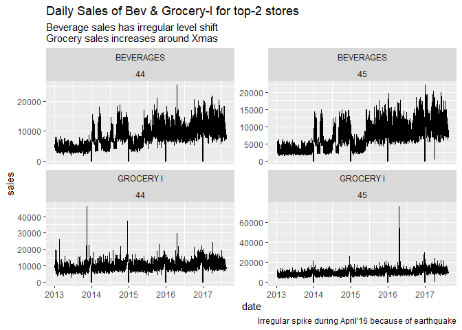<!-- -->

``` r
# Plot oil price
ggplot(fill(oil, dcoilwtico, .direction = "downup"),
       aes(x = date, y = dcoilwtico)) +
  geom_line() +
  labs(title = "Daily Oil Prices",
       subtitle = "Heterogeneous trend observed, seasonality is not clear")
```

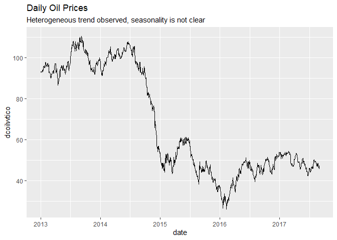<!-- -->

``` r
# Plot sales of selected two store X families
ggplot(filter(train_cleaned,
              family %in% c("GROCERY I", "CLEANING"),
              store_nbr %in% c(52, 25)),
       aes(x = date, y = sales)) +
  geom_line() +
  facet_wrap(family ~ store_nbr, scales = "free_y") +
  labs(title = "Daily Sales of Cleaning & Grocery-I for selected stores",
       subtitle = paste0("Store #25 has some missing sales around Sep'16",
                         "\nStore #52 is possibly a new store"))
```

<!-- -->

``` r
# irregular sales initially
ggplot(filter(train_cleaned,
              family %in% c("CELEBRATION", "HOME CARE")) |>
         summarize(sales = sum(sales), .by=c(date, family)),
       aes(x = date, y = sales)) +
  geom_line() +
  facet_wrap(family ~ ., scales = "free_y") +
  labs(title = "Daily Sales of Celebration & Home Care across all stores",
       subtitle = paste0("Irregular sales till May 2015"))
```

<!-- -->

``` r
# no liquor sale on sundays
ggplot(filter(train_cleaned,
              family %in% c("LIQUOR,WINE,BEER")) |>
         summarize(sales = sum(sales), .by = c(date)),
       aes(x = date, y = sales)) +
  geom_line() +
  labs(title = "Daily Sales of Liquor across all stores",
       subtitle = paste0("No sales on Sunday till May 2016"))
```

<!-- -->

``` r
# weekly liquor sale does not reveal no sale on sunday
ggplot(filter(train_cleaned,
              family %in% c("LIQUOR,WINE,BEER")) |>
         mutate(wk_of = floor_date(date, "week")) |>
         summarize(sales = sum(sales), .by = c(wk_of)),
       aes(x = wk_of, y = sales)) +
  geom_line() +
  labs(title = "Weekly Sales of Liquor across all stores",
       subtitle = paste0("Does not reveal no sales on Sunday"))
```

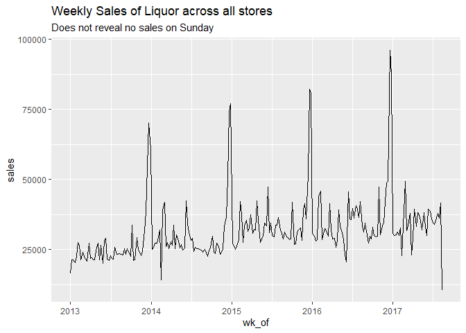<!-- -->

- Promotion

Some products are heavily promotion driven possibly. Check correlation
of sales with number of products on promotion for a given product family
without doing any aggregation,

``` r
sapply(
  unique(train_cleaned$family),
  \(x) cor(
    train_cleaned$sales[train_cleaned$family == x],
    train_cleaned$onpromotion[train_cleaned$family == x]
  )
) |> sort(decreasing = TRUE)
```

    ## SCHOOL AND OFFICE SUPPLIES                  BEVERAGES 
    ##                0.665616830                0.344275247 
    ##                    PRODUCE                     BEAUTY 
    ##                0.333163852                0.331517291 
    ##        HOME AND KITCHEN II                    SEAFOOD 
    ##                0.312342810                0.277303638 
    ##                  HOME CARE            LAWN AND GARDEN 
    ##                0.262989535                0.257954538 
    ##               PET SUPPLIES                  GROCERY I 
    ##                0.251390887                0.232960323 
    ##                    POULTRY         HOME AND KITCHEN I 
    ##                0.231316378                0.231301798 
    ##                      MEATS                 AUTOMOTIVE 
    ##                0.212478191                0.206150490 
    ##           LIQUOR,WINE,BEER              PERSONAL CARE 
    ##                0.195692359                0.195266668 
    ##                   CLEANING                       EGGS 
    ##                0.147368467                0.136891740 
    ##                       DELI                   LINGERIE 
    ##                0.123047443                0.107817109 
    ##               BREAD/BAKERY               FROZEN FOODS 
    ##                0.106278196                0.105155328 
    ##    PLAYERS AND ELECTRONICS                CELEBRATION 
    ##                0.100526053                0.093654131 
    ##                      DAIRY                 LADIESWEAR 
    ##                0.079920393                0.052973502 
    ##                  BABY CARE                   HARDWARE 
    ##                0.048337854                0.028552419 
    ##            HOME APPLIANCES                  MAGAZINES 
    ##                0.023453342                0.006694946 
    ##                 GROCERY II             PREPARED FOODS 
    ##                0.002002550               -0.026400924

``` r
ggplot(data = filter(train_cleaned, family == "SCHOOL AND OFFICE SUPPLIES") |>
         summarize(sales = sum(sales), onpromotion = sum(onpromotion),
                   .by = c(date, family)),
       aes(date, sales, colour=onpromotion)) +
  geom_line() +
  labs(title = "Sales of School & Office Supplies",
       subtitle = "Sales align very well with numbers of products on promotion")
```

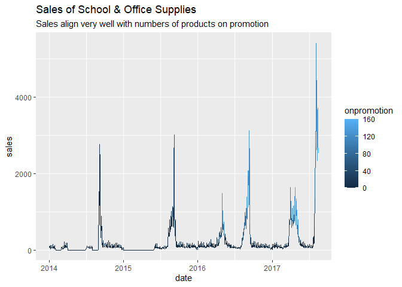<!-- -->

``` r
ggplot(data = summarize(train_cleaned, onpromotion = sum(onpromotion),
                        .by = c(date)),
       aes(date, onpromotion)) +
  geom_line() +
  labs(title = "Total number of products on promotion across product family",
       subtitle = paste0("Info on numbers of products on promotion available",
                         " from April'14 \nUnusual drop on Xmas & 1st Jan"))
```

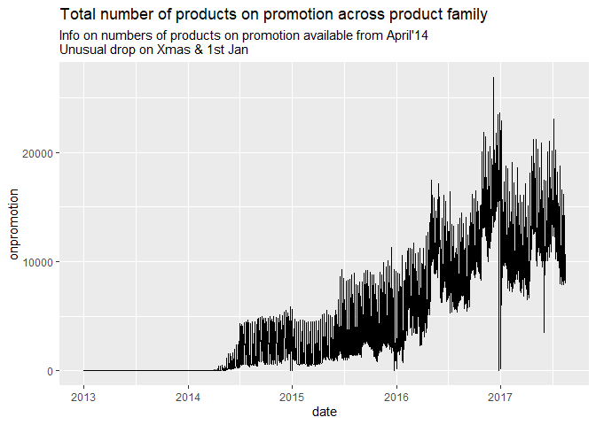<!-- -->

``` r
ggplot(data = filter(train_cleaned, onpromotion > 0) |>
         summarize(onpromotion = sum(onpromotion), sales = sum(sales),
                   .by = c(family, store_nbr, store_type)),
       aes(onpromotion, sales)) +
  geom_point(aes(color = store_type)) +
  scale_y_continuous("Sales (log scale)", trans = 'log10') +
  scale_x_continuous("Number of products on promotion (log scale)", trans = 'log10') +
  labs(title = "Log relationship between sales and number of products on promotion",
       subtitle = "it is log-log linear")
```

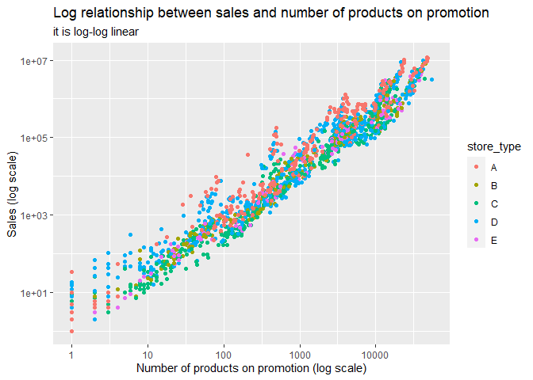<!-- -->

``` r
ggplot(data = filter(train_cleaned, onpromotion > 0,
                     family %in% c("GROCERY II", "DAIRY",
                                   "BREAD/BAKERY", "SEAFOOD")) |>
         summarize(onpromotion = sum(onpromotion), sales = sum(sales),
                   .by = c(family, store_nbr, store_type)),
       aes(onpromotion, sales)) +
  geom_point(aes(color = store_type)) +
  scale_y_continuous("Sales (log scale)", trans = 'log10') +
  scale_x_continuous("Number of products on promotion (log scale)", trans = 'log10') +
  facet_wrap(family ~ .) +
  labs(title = "Promo responsiveness in selected product families",
       subtitle = "Store type A & D has different responsiveness than others in some families")
```

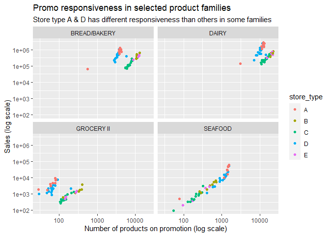<!-- -->

Based on above findings, we will use log of promotion information
instead of using it without any transformation in the model.

- Events

Some products are sensitive to events/holidays

``` r
# Box-plot of sales (filter >0) aggregating over store for each type of event
ggplot(
  data = filter(train_cleaned, sales > 0) |>
    summarise(sales = sum(sales), .by = c(date, evt_type, family)),
  aes(evt_type, sales)
) + 
  facet_wrap(~ family, scales = "free_y", ncol = 6) +
  geom_boxplot() +
  theme(axis.text.x = element_text(angle = 45, hjust = 1)) +
  labs(title = "Box-plot of sales by event type and product family",
       subtitle = "Families like Liquor, Frozen Food, etc. are very sensitive")
```


### Additional cleaning & features

- Some products have irregular sales in the initial period. Those
  irregular dates should be truncated so that the model does not get
  confused with bad data.

``` r
bad_period <- data.frame(
  family = c(
    "BABY CARE",
    "BEVERAGES",
    "BOOKS",
    "CELEBRATION",
    "DAIRY",
    "HOME AND KITCHEN I",
    "HOME AND KITCHEN II",
    "HOME APPLIANCES",
    "HOME CARE",
    "LADIESWEAR",
    "MAGAZINES",
    "PET SUPPLIES",
    "PLAYERS AND ELECTRONICS",
    "POULTRY",
    "PRODUCE",
    "SCHOOL AND OFFICE SUPPLIES"
  ),
  bad_till = as.Date(c(
    "2015-05-31",
    "2015-05-30",
    "2016-10-11",
    "2015-05-31",
    "2013-11-08",
    "2014-08-31",
    "2014-08-31",
    "2013-03-01",
    "2015-05-03",
    "2015-05-31",
    "2015-09-30",
    "2015-05-31",
    "2015-05-31",
    "2013-11-04",
    "2015-05-31",
    "2015-05-31"
  ))
)

train_cleaned_filt <- train_cleaned |>
  left_join(bad_period, by = c("family")) |>
  filter((date > bad_till) | is.na(bad_till)) |>
  select(-bad_till)
```

- Since there are so many events (event descriptions) in the data, lets
  try to figure out some important events in terms of high (or low)
  sales compared to the sales when there were no events. The idea is to
  algorithmically figure out some specific event descriptions for
  store-family combinations using the training data, and flag those
  events as important. We would test only those events in the model,
  using one-hot encoding approach.

- Idea is to extract q3 & q1 of sales (filtered for \>0) for days
  without any events. And then use them to define a threshold (slightly
  inflate or deflate accordingly).

``` r
# sales > 1.5 * 75th percentile of sales for non-event days at store-family level
# sales < 0.5 * 25th percentile of sales for non-event days at store-family level
imp_events <- train_cleaned_filt |>
  filter(is.na(evt_desc), sales > 0) |>
  summarize(q3_no_evt = quantile(sales, 0.75),
            q1_no_evt = quantile(sales, 0.25),
            .by = c("store_nbr", "family")) |>
  inner_join(train_cleaned_filt, multiple = "all", by = c("store_nbr", "family")) |>
  filter((sales > q3_no_evt * 1.5) | ((sales < q1_no_evt * 0.5) & (sales > 0)),
         !is.na(evt_desc)) |>
  distinct(store_nbr, family, evt_desc_gran, .keep_all = FALSE) |>
  mutate(imp_event = TRUE,
         evt_desc_gran = as.factor(evt_desc_gran),
         imp_evt_enc = as.integer(evt_desc_gran))

# A function to create on-hot encoding dummy for the selected events
create_dummy <- function(df, df_dummy_col, dummy_id_list, dummy_prefix) {
  for (dum in seq_along(dummy_id_list)) {
    df[[paste0(dummy_prefix, "_", dummy_id_list[dum])]] <- ifelse(
      !is.na(df[[df_dummy_col]]) & (df[[df_dummy_col]] == dummy_id_list[dum]),
      1L,
      0L
    )
  }
  return(df)
}

# Add event selected in train data
train_cleaned_evt <- train_cleaned_filt |>
  left_join(imp_events, by = c("store_nbr", "family", "evt_desc_gran")) |>
  mutate(evt_selected = if_else(imp_event, evt_desc_gran, NA)) |>
  # One-hot encoding of the selected events
  create_dummy(
  "imp_evt_enc",
  unique(imp_events$imp_evt_enc),
  "evt_sel_hot"
)

# Add event selected in test data
test_cleaned_evt <- test_cleaned |>
  left_join(imp_events, by = c("store_nbr", "family", "evt_desc_gran")) |>
  mutate(evt_selected = if_else(imp_event, evt_desc_gran, NA)) |>
  # One-hot encoding of the selected events
  create_dummy(
  "imp_evt_enc",
  unique(imp_events$imp_evt_enc),
  "evt_sel_hot"
)
```

### Naive approach for causal relation

Deriving correlation of sales of each product family with other product
families.

- Top two (in absolute strength) correlated product families are
  considered to check.

- As noticed from the chart, most product families sales are strongly
  correlated with some other family. We may use some of them them as
  causal relation while modeling.

- Top selling family, ‘Grocery-I’ is strongly correlated with ‘Personal
  Care’.

- ‘Beverage’ family has strong correlation with sales of ‘Players and
  Electronics’.

``` r
# Create correlation matrix

corr_matrix <- train_cleaned_evt |>
  # filter(store_nbr == 44) |>
  summarise(total_sales = sum(sales), .by = c(date, family)) |>
  select(date, family, total_sales) |>
  pivot_wider(names_from = family, values_from = total_sales, values_fill = 0) |>
  select(-date) |>
  cor(use = "pairwise.complete.obs") |>
  as.data.frame()

# Remove diagonal correlations (same family), and rank order based on abs(cor)
corr_matrix_df <- corr_matrix |>
  mutate(family_from = rownames(corr_matrix)) |>
  pivot_longer(cols = -family_from, names_to = "family_to", values_to = "cor") |>
  filter(family_from != family_to) |>
  arrange(family_from, desc(abs(cor))) |>
  mutate(rank = row_number(), .by = family_from)

# Plot top 2 ranked correl families
ggplot(filter(corr_matrix_df, rank < 3)) +
  geom_col(aes(x = family_from, y = cor, group = family_to),
           position = "dodge", color = "darkgrey", fill = "white") +
  geom_text(aes(x = family_from, y = cor + 0.02,
                group = family_to, label = family_to),
            position = position_dodge(width = .9), size = 2) +
  coord_flip() +
  labs(title = "Most product families sales are strongly correlated")
```

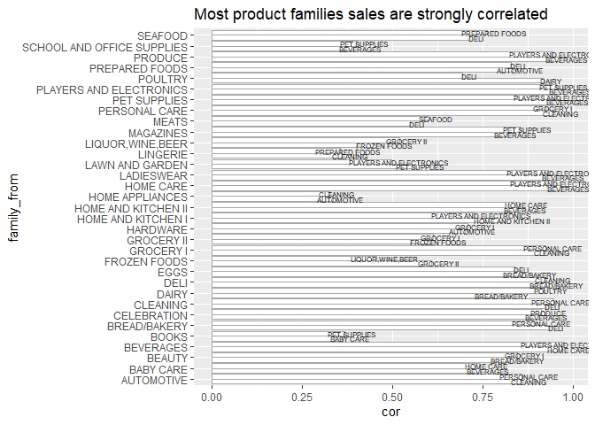<!-- -->

**Create some causal variables** in the data based on above findings.
The top-2 correlated (in absolute sense) products’ promotion information
we will use as a cross-product information while modeling the given
product’s sales. For example, `BABY CARE` has top-2 correlated products
as `HOME CARE` & `BEVERAGES`; so we will include the promotion
information of `HOME CARE` & `BEVERAGES` while modeling the sales of
`BABY CARE`. Hypothesis is, if the promotion on `HOME CARE` or
`BEVERAGES` increases then that may cause increase in sales on
`BABY CARE` products.

**Note, log transformation** to be created for promotion information
based on earlier EDA.

``` r
# filter the correlation data having abs(cor)>0.5 and select top-2
corr_filtered <- corr_matrix_df |>
  filter(rank < 3, abs(cor) > 0.50) |>
  pivot_wider(id_cols = "family_from", names_from = "rank",
              values_from = "family_to", names_prefix = "crs_fam_") |>
  rename(family = family_from)

# Merge the promotion information of correlated products for a given product
# at store day level - and add log transformation on promotion info
crs_fam_promo_create <- function(df, crs_mapping,
                                 crs_prefix = "crs_fam_") {
  # add log transformation on promotion
  df <- mutate(df, onpromotion_log = log1p(onpromotion))
  # list of columns having the mapping info (number of cross prods)
  crs_fams <- names(crs_mapping)[grepl(crs_prefix, names(crs_mapping))]
  # get the mapping in main data
  df_crs_map <- left_join(df, crs_mapping, by = "family")
  # loop on cross prod cols to merge the relevant information
  for (crs_loop in seq_along(crs_fams)) {
    crs_fam <- crs_fams[crs_loop]
    crs_prm <- paste0("onpromotion_", crs_loop)
    crs_prm_log <- paste0("onpromotion_log_", crs_loop)
    df_crs_map <- df_crs_map |>
      left_join(
        select(df, date, store_nbr, family, onpromotion, onpromotion_log) |>
          # dynamically rename
          rename({{crs_prm}} := onpromotion,
                 {{crs_prm_log}} := onpromotion_log),
        by = setNames(
          c("date", "store_nbr", "family"),
          c("date", "store_nbr", crs_fam)
        )
      ) |>
      # replace missing with 0 on newly created column
      replace_na(setNames(list(0, 0), c(crs_prm, crs_prm_log))) |>
      # remove mapping product family name column
      select(-all_of(crs_fam))
  }
  return(df_crs_map)
}

# Add the cross product promotion on train and log transformation on promo
train_cleaned_crs <- crs_fam_promo_create(train_cleaned_evt, corr_filtered)
# Add the cross product promotion on test and log transformation on promo
test_cleaned_crs <- crs_fam_promo_create(test_cleaned_evt, corr_filtered)
```

## Analysing biggest store-family

Focusing on the Grocery-I product family for top grossing store (#44) to
start with for an univariate time-series analysis.

### Manual model tuning

First, let us explore the ACF and see the order identified by
`auto.arima` without any `xreg`.

``` r
# Create a time series object for Grocery store #44
gro_44 <- xts(
  train_cleaned_crs$sales[
    train_cleaned_crs$store_nbr==44 & train_cleaned_crs$family=="GROCERY I"
  ],
  frequency = 7,
  order.by = train_cleaned_crs$date[
    train_cleaned_crs$store_nbr==44 & train_cleaned_crs$family=="GROCERY I"
  ]
)
attr(gro_44, "frequency") <- 7

# plots and ACF/PACF
plot(gro_44, main = "Daily Sales of Grocery-I for Store #44")
```

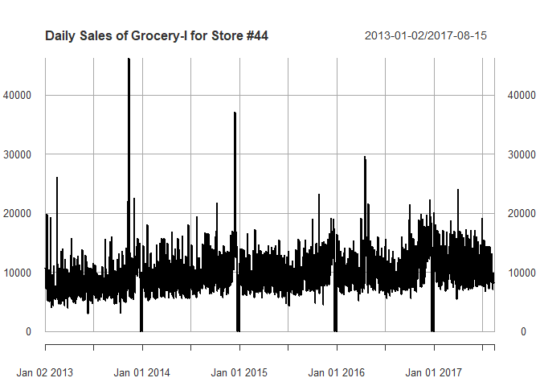<!-- -->

``` r
acf(gro_44, main = "ACF: Grocery-I, Store #44")
```

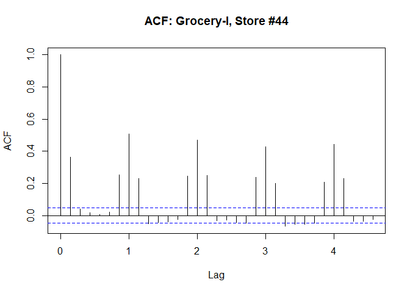<!-- -->

``` r
pacf(gro_44, main = "PACF: Grocery-I, Store #44")
```

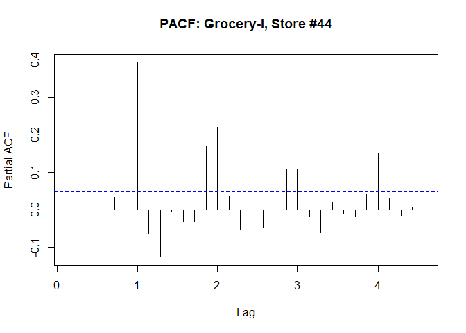<!-- -->

**Some observations**

- There is noticeable trend, we may have to difference the data, or use
  `stl` to remove trend.
- It is definitely 7 period seasonal as the above ACF spikes in the gap
  of 7 lags.
- ACF hints a seasonal differencing might also be necessary as decay
  rate is not fast enough.
- ACF also suggests we may have to use some MA order (2?)
- PACF decayed faster than ACF, possibly there is no need of seasonal
  AR, only a regular AR will be sufficient.

Build a model with `auto.arima` to see the fitted orders.

``` r
m1 <- auto.arima(gro_44)
m1
```

    ## Series: gro_44 
    ## ARIMA(0,1,2)(0,0,1)[7] 
    ## 
    ## Coefficients:
    ##           ma1      ma2    sma1
    ##       -0.6693  -0.3130  0.3004
    ## s.e.   0.0230   0.0232  0.0196
    ## 
    ## sigma^2 = 9360544:  log likelihood = -15924.36
    ## AIC=31856.71   AICc=31856.74   BIC=31878.43

``` r
tsdiag(m1)
```

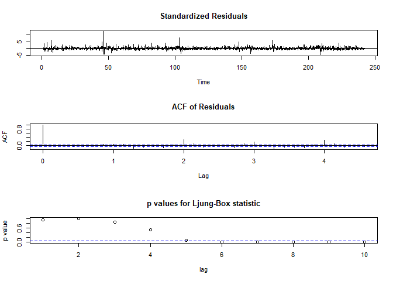<!-- -->

``` r
pacf(resid(m1), lag.max = 50, main = "PACF: Grocery-I, Store #44, auto univariate")
```

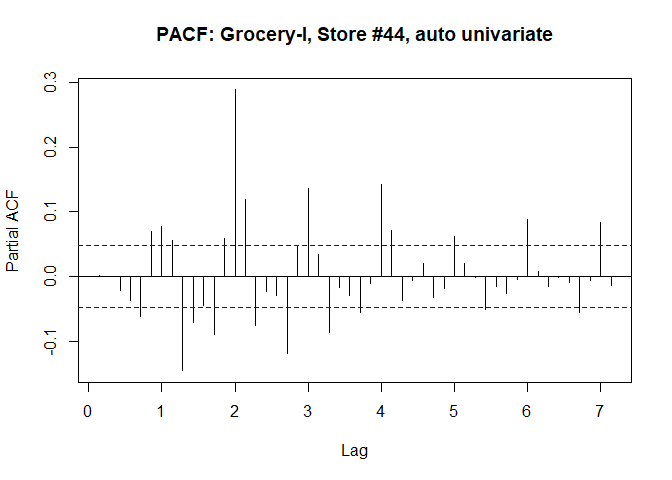<!-- -->

``` r
acf(resid(m1), lag.max = 50, main = "PACF: Grocery-I, Store #44, auto univariate")
```

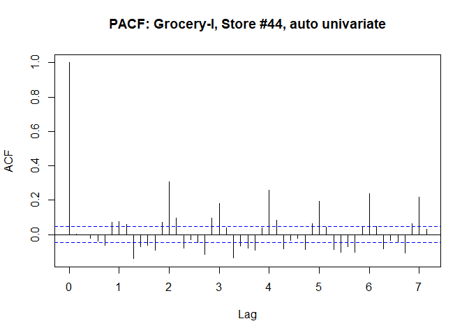<!-- -->

`auto.arima` fitted SARIMA (0,1,2), (0,0,1) for frequency 7, but the
residual is not completely clean.

Build a different model based on previous observations on ACF, PACF.

- Seasonal difference of order 1
- Seasonal MA 1
- Regular AR 2

``` r
# pacf(diff(gro_44, differences = 7)[!is.na(diff(gro_44, differences = 7))])
# m2 <- arima(gro_44, order=c(2,0,2), seasonal = list(order=c(1,2,2), period=7))
m2 <- arima(gro_44, order=c(2,0,0), seasonal = list(order=c(0,1,1), period=7))
m2
```

    ## 
    ## Call:
    ## arima(x = gro_44, order = c(2, 0, 0), seasonal = list(order = c(0, 1, 1), period = 7))
    ## 
    ## Coefficients:
    ##          ar1     ar2     sma1
    ##       0.2674  0.1169  -0.9609
    ## s.e.  0.0244  0.0244   0.0078
    ## 
    ## sigma^2 estimated as 6991598:  log likelihood = -15631.44,  aic = 31270.89

``` r
tsdiag(m2)
```

<!-- -->

AIC improved from `auto.arima` output. ACF of residual looks cleaner.
But, Box-test is still not very good.

Trying out with the ACF and PACF plots of residuals to figure out the
SARIMA orders.

``` r
pacf(resid(m2), lag.max = 50, main = "PACF: Grocery-I, Store #44, manual model 1")
```

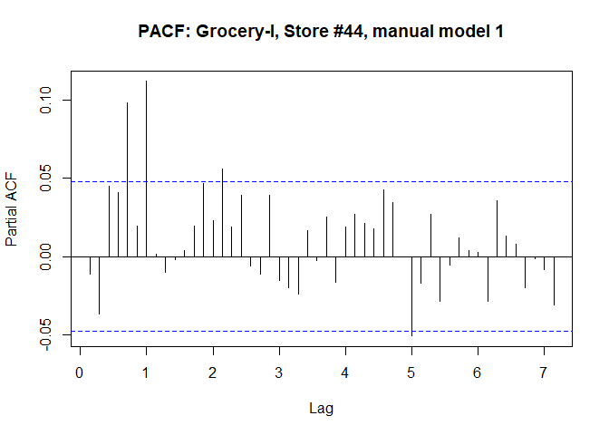<!-- -->

``` r
acf(resid(m2), lag.max = 50, main = "ACF: Grocery-I, Store #44, manual model 1")
```

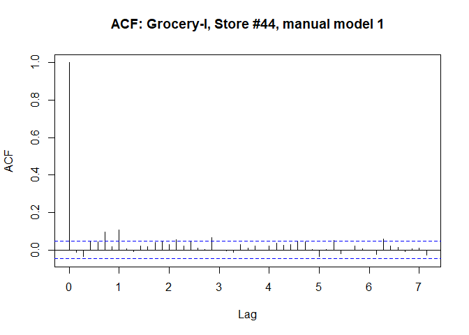<!-- -->

We may try increasing regular MA order and adding seasonal AR order as
the PACF of previous model’s residual still shows significant at
seasonal lag 1. And the Box-test’s p-values are significant beyond lag
of 3 periods.

``` r
m3 <- arima(gro_44, order=c(2,0,1), seasonal = list(order=c(1,1,1), period=7))
m3
```

    ## 
    ## Call:
    ## arima(x = gro_44, order = c(2, 0, 1), seasonal = list(order = c(1, 1, 1), period = 7))
    ## 
    ## Coefficients:
    ##          ar1      ar2      ma1    sar1     sma1
    ##       1.1353  -0.1722  -0.8838  0.0651  -0.9775
    ## s.e.  0.0604   0.0404   0.0510  0.0263   0.0059
    ## 
    ## sigma^2 estimated as 6787710:  log likelihood = -15607.46,  aic = 31226.91

``` r
tsdiag(m3, 20)
```

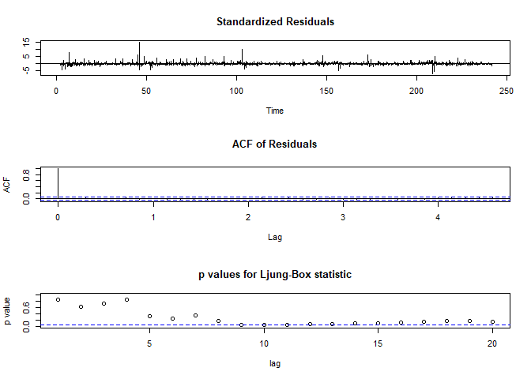<!-- -->

``` r
pacf(resid(m3), lag.max = 50, main = "PACF: Grocery-I, Store #44, manual model 2")
```

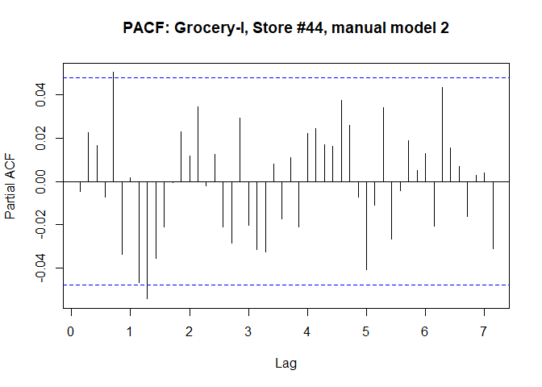<!-- -->

``` r
acf(resid(m3), lag.max = 50, main = "ACF: Grocery-I, Store #44, manual model 2")
```

<!-- -->

Now the AIC improved further. And the Box-test looks relatively good.

However, the standardized residual plot shows some time dependent
variation. Those issues may get better after incorporating earthquake
and other events impact in the model. ARCH may help as well. And also,
using cross information of ‘Personal Care’ may improve too as that was
most strongly correlated with Grocery-I sales.

Let us add some of the `xreg` on the same model spec as identified above
and reevaluate.

- Add the first January dummy
- Number of products on promotion
- Promotion info of cross products
- Share of promotion of the product in a store with respect to the city
- Oil price
- Liquor Sunday dummy, if relevant
- One-hot encoding of selected important events for the chosen
  store-family

``` r
m4 <- Arima(
  gro_44, order=c(2,0,1), seasonal = list(order=c(1,1,1), period=7),
  xreg = as.matrix(
    train_cleaned_crs[
      train_cleaned_crs$store_nbr==44 & train_cleaned_crs$family=="GROCERY I",
      names(train_cleaned_crs) %in% c(
        "first_jan", "onpromotion", "crs_str_prm_rat", "dcoilwtico",
        paste0("evt_sel_hot_",
               imp_events$imp_evt_enc[imp_events$store_nbr==44 &
                                        imp_events$family=="GROCERY I"]),
        names(train_cleaned_crs)[grepl("onpromotion_[[:digit:]]+",
                                       names(train_cleaned_crs))]
      )
    ]
  )
)

m4
```

    ## Series: gro_44 
    ## Regression with ARIMA(2,0,1)(1,1,1)[7] errors 
    ## 
    ## Coefficients:
    ##          ar1      ar2      ma1    sar1     sma1  onpromotion  dcoilwtico
    ##       1.0925  -0.1262  -0.8875  0.0162  -0.9783      10.5740    -17.9115
    ## s.e.  0.0423   0.0320   0.0327  0.0267   0.0052       5.1297     11.6120
    ##         first_jan  crs_str_prm_rat  evt_sel_hot_48  evt_sel_hot_77
    ##       -12366.7325        -422.3936        3937.252       19737.208
    ## s.e.     969.7412         373.6739        1175.113        2335.638
    ##       evt_sel_hot_89  evt_sel_hot_72  evt_sel_hot_47  evt_sel_hot_35
    ##             9214.032        8121.012        4260.926        1369.262
    ## s.e.        2302.714        2262.672        1166.419        1131.492
    ##       evt_sel_hot_87  evt_sel_hot_17  evt_sel_hot_49  evt_sel_hot_67
    ##            16005.200        4859.965        3196.256       15737.933
    ## s.e.        2337.322        1011.158        1159.082        2300.096
    ##       evt_sel_hot_51  evt_sel_hot_61  onpromotion_1  onpromotion_2
    ##             4762.032        1656.601        25.0446        10.9060
    ## s.e.        1306.052        2258.959        33.5411        12.0617
    ## 
    ## sigma^2 = 5503331:  log likelihood = -15420.04
    ## AIC=30888.08   AICc=30888.8   BIC=31018.31

``` r
tsdiag(m4, 20)
```

<!-- -->

``` r
pacf(resid(m4), lag.max = 50, main = "PACF: Grocery-I, Store #44, manual model 3")
```

<!-- -->

``` r
acf(resid(m4), lag.max = 50, main = "ACF: Grocery-I, Store #44, manual model 3")
```

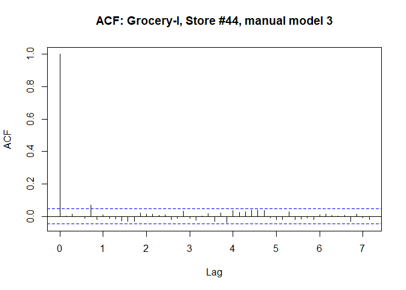<!-- -->

Clearly the AIC of above model with `xreg` is much better than the
previous model without any `xreg`. Also, most of the variables look
significant (except \~5 out of \~20 variables).

Fitting same model spec on log of sales (+1) and use log of promotion.

``` r
m5 <- Arima(
  log1p(gro_44), order=c(2,0,1), seasonal = list(order=c(1,1,1), period=7),
  xreg = as.matrix(
    train_cleaned_crs[
      train_cleaned_crs$store_nbr==44 & train_cleaned_crs$family=="GROCERY I",
      names(train_cleaned_crs) %in% c(
        "first_jan", "onpromotion_log", "crs_str_prm_rat", "dcoilwtico",
        paste0("evt_sel_hot_",
               imp_events$imp_evt_enc[imp_events$store_nbr==44 &
                                        imp_events$family=="GROCERY I"]),
        names(train_cleaned_crs)[grepl("onpromotion_log_",
                                       names(train_cleaned_crs))]
      )
    ]
  )
)

m5
```

    ## Series: log1p(gro_44) 
    ## Regression with ARIMA(2,0,1)(1,1,1)[7] errors 
    ## 
    ## Coefficients:
    ##          ar1      ar2      ma1    sar1     sma1  dcoilwtico  first_jan
    ##       1.1502  -0.1790  -0.8887  0.0324  -0.9831     -0.0008    -9.2913
    ## s.e.  0.0416   0.0329   0.0312  0.0265   0.0051      0.0011     0.0854
    ##       crs_str_prm_rat  evt_sel_hot_48  evt_sel_hot_77  evt_sel_hot_89
    ##               -0.0527          0.3400          1.1368          0.5914
    ## s.e.           0.0344          0.0987          0.1965          0.1917
    ##       evt_sel_hot_72  evt_sel_hot_47  evt_sel_hot_35  evt_sel_hot_87
    ##               0.4947          0.3533          0.0270          1.0531
    ## s.e.          0.1867          0.0966          0.0933          0.1965
    ##       evt_sel_hot_17  evt_sel_hot_49  evt_sel_hot_67  evt_sel_hot_51
    ##               0.4529          0.2106          0.7685          0.3575
    ## s.e.          0.0834          0.0965          0.1914          0.1066
    ##       evt_sel_hot_61  onpromotion_log  onpromotion_log_1  onpromotion_log_2
    ##               0.0942           0.0389             0.0019             0.0155
    ## s.e.          0.1858           0.0138             0.0150             0.0133
    ## 
    ## sigma^2 = 0.03818:  log likelihood = 359.75
    ## AIC=-671.49   AICc=-670.77   BIC=-541.25

``` r
tsdiag(m5, 20)
```

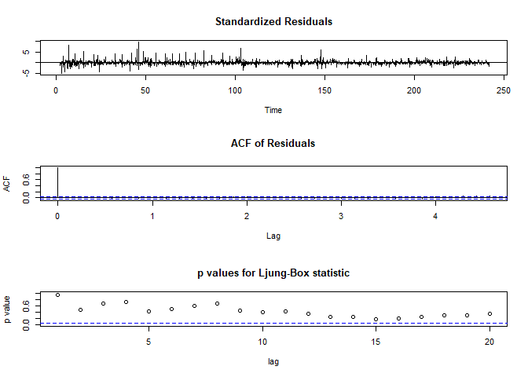<!-- -->

``` r
pacf(resid(m5), lag.max = 50, main = "PACF: Grocery-I, Store #44, manual model 4 (log sales)")
```

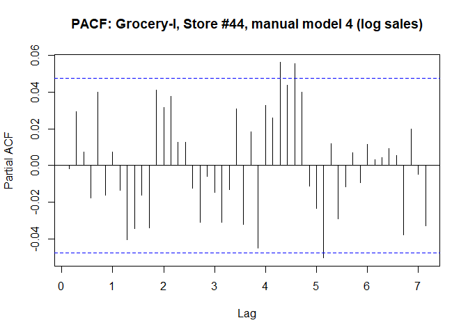<!-- -->

``` r
acf(resid(m5), lag.max = 50, main = "ACF: Grocery-I, Store #44, manual model 4 (log sales)")
```

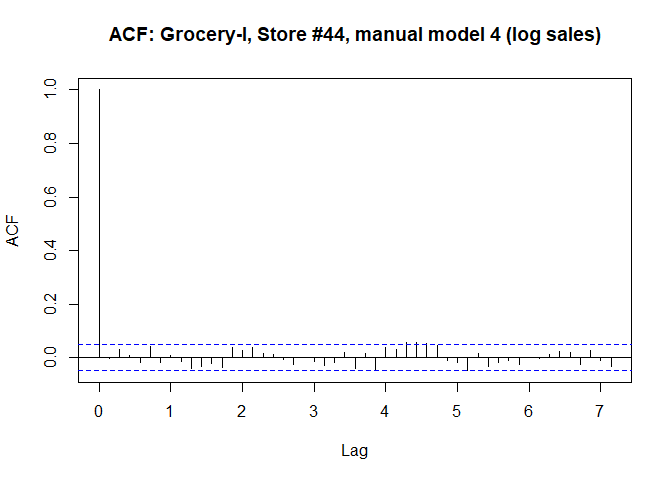<!-- -->

``` r
ff2 <- forecast(
  m5, h=16,
  xreg = as.matrix(
    test_cleaned_crs[
      test_cleaned_crs$store_nbr==44 & test_cleaned_crs$family=="GROCERY I",
      names(test_cleaned_crs) %in% c(
        "first_jan", "onpromotion_log", "crs_str_prm_rat", "dcoilwtico",
        paste0("evt_sel_hot_",
               imp_events$imp_evt_enc[imp_events$store_nbr==44 &
                                        imp_events$family=="GROCERY I"]),
        names(test_cleaned_crs)[grepl("onpromotion_log_",
                                       names(test_cleaned_crs))]
      )
    ]
  )
)

ts.plot(exp(ff2$x) - 1, exp(ff2$mean) - 1, lty=c(3,1), col=c('black', 'red'),
        main = "Forecast from manual tuned model fitted on log1p(sales)")
```

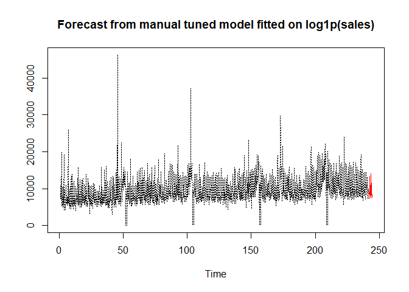<!-- -->

### Cross validation

**Beware** - it will take a while to run the CV, *around 20-30 minutes,
each*.

Evaluating RMSLE (RMSE on log of sales gives RMSLE on original sales
series) using **time series cross validation**.

``` r
# Forecasting function to be used inside `tsCV`

# Defining a function generator below with flexibility of specifying arima
# order and option to use xreg
arima_forecasting <- function(order, seasonal, usereg = FALSE) {
  force(order)
  force(seasonal)
  if (!usereg) {
    function(x, h) {
      forecast(
        Arima(x, order = order, seasonal = seasonal),
        h = h
      )
    }
  } else {
    function(x, h, xreg, newxreg) {
      # browser()
      forecast(
        Arima(x, xreg = xreg, order = order, seasonal = seasonal),
        xreg = newxreg,
        h = h
      )
    }
  }
}

# Calculate CV errors
err <- tsCV(
  log1p(gro_44),
  arima_forecasting(
    # order=c(1,0,2), seasonal = list(order=c(0,1,1), period=7),
    order = arimaorder(m5)[c("p","d","q")],
    seasonal = list(
                order = arimaorder(m5)[c("P","D","Q")],
                period = arimaorder(m5)[c("Frequency")]
              ),
    usereg = TRUE
  ),
  initial = max(0, ceiling(length(gro_44)*0.95)),
  h = 16,
  xreg = as.matrix(train_cleaned_crs[
    train_cleaned_crs$store_nbr==44 & train_cleaned_crs$family=="GROCERY I",
    names(train_cleaned_crs) %in% c(
      "first_jan", "onpromotion_log", "crs_str_prm_rat", "dcoilwtico",
      paste0("evt_sel_hot_",
             imp_events$imp_evt_enc[imp_events$store_nbr==44 &
                                      imp_events$family=="GROCERY I"]),
      names(train_cleaned_crs)[grepl("onpromotion_log_",
                                     names(train_cleaned_crs))]
    )
  ])
)

# err[1660:1683, ]

# Compute the RMSLE values and remove missing values
rmsle <- sqrt(colMeans(err^2, na.rm = TRUE))

# Plot the RMSLE values against the forecast horizon
data.frame(h = 1:16, RMSLE = rmsle) |>
  ggplot(aes(x = h, y = RMSLE)) +
  geom_point() +
  labs(title = "Avg RMSLE by 'h' of manually trained model Grocery-I Store #44")
```

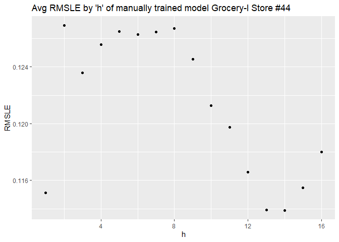<!-- -->

``` r
# RMSLE of each evaluated models during CV
print("RMSLE of each evaluated models during CV: manual trained")
```

    ## [1] "RMSLE of each evaluated models during CV: manual trained"

``` r
boxplot(
  sqrt(rowMeans(err^2, na.rm = TRUE))[!is.na(sqrt(rowMeans(err^2, na.rm = TRUE)))],
  main = "Boxplot of RMSLE of each rolling window during CV: manual trained"
)
```

<!-- -->

``` r
# average of RMSLE of all evaluated models during CV
print("Average of RMSLE of all evaluated models during CV: manual trained")
```

    ## [1] "Average of RMSLE of all evaluated models during CV: manual trained"

``` r
mean(sqrt(rowMeans(err^2, na.rm = TRUE)), na.rm = TRUE)
```

    ## [1] 0.1211115

Let us see how the model performs if it is trained using `auto.arima`
with regressors.

``` r
# fit auto.arima with xreg
m6 <- auto.arima(
  log1p(gro_44),
  xreg = as.matrix(
    train_cleaned_crs[
      train_cleaned_crs$store_nbr==44 & train_cleaned_crs$family=="GROCERY I",
      names(train_cleaned_crs) %in% c(
        "first_jan", "onpromotion_log", "crs_str_prm_rat", "dcoilwtico",
        paste0("evt_sel_hot_",
               imp_events$imp_evt_enc[imp_events$store_nbr==44 &
                                        imp_events$family=="GROCERY I"]),
        names(train_cleaned_crs)[grepl("onpromotion_log_",
                                       names(train_cleaned_crs))]
      )
    ]
  )
)

# Calculate CV errors
err_a <- tsCV(
  log1p(gro_44),
  arima_forecasting(
    # order=c(1,0,2), seasonal = list(order=c(1,1,2), period=7),
    order = arimaorder(m6)[c("p","d","q")],
    seasonal = list(
                order = arimaorder(m6)[c("P","D","Q")],
                period = arimaorder(m6)[c("Frequency")]
              ),
    usereg = TRUE
  ),
  initial = max(0, ceiling(length(gro_44)*0.95)),
  h = 16,
  xreg = as.matrix(train_cleaned_crs[
    train_cleaned_crs$store_nbr==44 & train_cleaned_crs$family=="GROCERY I",
    names(train_cleaned_crs) %in% c(
      "first_jan", "onpromotion_log", "crs_str_prm_rat", "dcoilwtico",
      paste0("evt_sel_hot_",
             imp_events$imp_evt_enc[imp_events$store_nbr==44 &
                                      imp_events$family=="GROCERY I"]),
      names(train_cleaned_crs)[grepl("onpromotion_log_",
                                     names(train_cleaned_crs))]
    )
  ])
)

# err_a[1660:1683, ]

# Compute the RMSLE values and remove missing values
rmsle_a <- sqrt(colMeans(err_a^2, na.rm = TRUE))

# Plot the RMSLE values against the forecast horizon
data.frame(h = 1:16, RMSLE = rmsle_a) |>
  ggplot(aes(x = h, y = RMSLE)) +
  geom_point() +
  labs(title = "Avg RMSLE by 'h' of auto trained model Grocery-I Store #44")
```

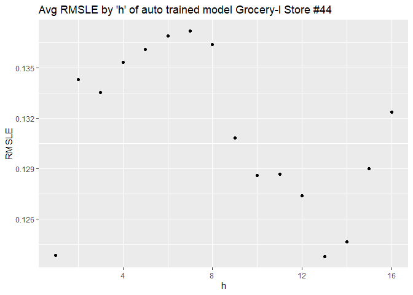<!-- -->

``` r
# RMSLE of each evaluated models during CV
print("RMSLE of each evaluated models during CV: auto trained")
```

    ## [1] "RMSLE of each evaluated models during CV: auto trained"

``` r
boxplot(
  sqrt(rowMeans(err_a^2, na.rm = TRUE))[!is.na(sqrt(rowMeans(err_a^2, na.rm = TRUE)))],
  main = "Boxplot of RMSLE of each rolling window during CV: auto trained"
)
```

<!-- -->

``` r
# average of RMSLE of all evaluated models during CV
print("Average of RMSLE of all evaluated models during CV: auto trained")
```

    ## [1] "Average of RMSLE of all evaluated models during CV: auto trained"

``` r
mean(sqrt(rowMeans(err_a^2, na.rm = TRUE)), na.rm = TRUE)
```

    ## [1] 0.1305668

**Comparison of auto and manually identified SARIMA orders**:

``` r
print(paste0("Order of manual model (p,d,q, P,D,Q, freq):",
             paste(arimaorder(m5), collapse = "|")))
print(paste0("Order of auto model (p,d,q, P,D,Q, freq):  ",
             paste(arimaorder(m6), collapse = "|")))
print(paste0("AIC of manual model: ", AIC(m5)))
print(paste0("AIC of auto model:   ", AIC(m6)))
print(paste0("CV RMSLE of manual model: ",
             mean(sqrt(rowMeans(err^2, na.rm = TRUE)), na.rm = TRUE)))
print(paste0("CV RMSLE of auto model:   ",
             mean(sqrt(rowMeans(err_a^2, na.rm = TRUE)), na.rm = TRUE)))
```

    ## [1] "Order of manual model (p,d,q, P,D,Q, freq):2|0|1|1|1|1|7"
    ## [1] "Order of auto model (p,d,q, P,D,Q, freq):  0|0|3|2|1|0|7"
    ## [1] "AIC of manual model: -671.492025460803"
    ## [1] "AIC of auto model:   -282.693460230663"
    ## [1] "CV RMSLE of manual model: 0.121111503787154"
    ## [1] "CV RMSLE of auto model:   0.130566771467746"

In the above scenario the RMSLE of manually identified model spec is
better than the auto one. Also the manual one has way better AIC. Model
complexity is similar in terms of SARIMA parameters.

It took significant time for the cross validation with pure `auto.arima`
where seasonal parameters are also estimated. Let’s try using
`forecast::stlm` which uses an automated version of `stl`
(`forecast::mstl`) to find the `s.window` and then fits `auto.arima`
without seasonal parameters.

``` r
# Fit stlm
mm <- stlm(
  as.ts(log1p(gro_44)), method = "arima",
  xreg = as.matrix(
     train_cleaned_crs[
         train_cleaned_crs$store_nbr==44 & train_cleaned_crs$family=="GROCERY I",
         names(train_cleaned_crs) %in% c(
             "first_jan", "onpromotion_log", "crs_str_prm_rat", "dcoilwtico",
             paste0("evt_sel_hot_",
                    imp_events$imp_evt_enc[imp_events$store_nbr==44 &
                                               imp_events$family=="GROCERY I"]),
             names(train_cleaned_crs)[grepl("onpromotion_log_",
                                            names(train_cleaned_crs))]
         )
     ]
  )
)
# Calculate CV errors
err_b <- tsCV(
    as.ts(log1p(gro_44)),
    forecastfunction = function(x, h, xreg, newxreg) {
      # Specified previously fitted stlm model so that it does not build new one
        forecast(stlm(x, method = "arima", xreg = xreg, model = mm),
                 h=h, xreg=newxreg)
    },
    initial = max(0, ceiling(length(gro_44)*0.95)),
    h = 16,
    xreg = as.matrix(train_cleaned_crs[
        train_cleaned_crs$store_nbr==44 & train_cleaned_crs$family=="GROCERY I",
        names(train_cleaned_crs) %in% c(
            "first_jan", "onpromotion_log", "crs_str_prm_rat", "dcoilwtico",
            paste0("evt_sel_hot_",
                   imp_events$imp_evt_enc[imp_events$store_nbr==44 &
                                              imp_events$family=="GROCERY I"]),
            names(train_cleaned_crs)[grepl("onpromotion_log_",
                                           names(train_cleaned_crs))]
        )
    ])
)

# average of RMSLE of all evaluated models during CV
print("Average of RMSLE of all evaluated models during CV: auto with stlm")
```

    ## [1] "Average of RMSLE of all evaluated models during CV: auto with stlm"

``` r
mean(sqrt(rowMeans(err_b^2, na.rm = TRUE)), na.rm = TRUE)
```

    ## [1] 0.12237

`stlm` resulted CV RMSLE as 0.1224 compared to pure `auto.arima`’s
0.1306 and manual tuned’s 0.1211. The run time was \~80% less based on
`profvis` profiling for Grocery-I store \#44 sales data modeling. `stlm`
with ARIMA turns out to be a great time saver with decent model
performance.

## `auto.arima` benchmarking

The idea here is to use `auto.arima` on each individual store-family
sales data along with the list of regressors. This would give some
result as a benchmark to compare the output with some other modeling
technique (if used).

The list of regressors has to be defined dynamically - if any variable
has no variation (constant throughout) then that should not be
considered. If none of the variable has any variation then a model to be
built without any regressors. Also the list of important events are to
be identified dynamically for each store-family combo.

Also, we will use log of sales (+1) to use in `auto.arima`, this will
also ensure the predicted values in original scale is always
non-negative. Predicted values will be adjusted for this change,
`exp(predicted)-1` (if it is negative then 0).

Using `stlm` function to deseasonalize and fit non-seasonal ARIMA - to
potentially save some time.

``` r
# Extract list of stores
store_list <- unique(train_cleaned_crs$store_nbr)
# Extract list of product family
fam_list <- unique(train_cleaned_crs$family)
# Create empty data frame for 16 days ahead forecast in Kaggle submission format
test_submission <- data.frame(id = numeric(), sales = numeric())
# loop counter
cc <- 0

# -- BEWARE - THIS LOOP MAY TAKE 7-8 HOURS TO RUN IF NOT PARALLELIZED --

# Loop over all the univariate time-series and fit auto.arima with regressors
# Remove those regresssors which do not have any variation
# If auto.arima faces any error then produce 0 forecast
for (st_i in seq_along(store_list)) {
  for (fam_i in seq_along(fam_list)) {
    # st_i <- fam_i <- 1
    st_s <- store_list[st_i]
    fam_s <- fam_list[fam_i]
    # increase loop counter
    cc <- cc + 1
    # display loop progress
    cat(
      paste(st_s, fam_s,
            round(cc / length(store_list) / length(fam_list) * 100),
            "% completed ")
    )
    # list of regressors without the one-hot encoded events
    regressor_list <- c(
      "first_jan", "liquor_sunday", "onpromotion_log",
      "crs_str_prm_rat", "dcoilwtico",
      names(train_cleaned_crs)[grepl("onpromotion_log_",
                                     names(train_cleaned_crs))]
    )
    # relevant one-hot encoded events for selected store-family
    evt_one_hots <- paste0(
      "evt_sel_hot_",
      imp_events$imp_evt_enc[
        imp_events$store_nbr == st_s & imp_events$family == fam_s
      ]
    )
    # update list of regressors with one-hot encoded events
    if (length(evt_one_hots) == 1 && all(evt_one_hots == "evt_sel_hot_")) {
      regressor_list <- regressor_list
    } else {
      regressor_list <- c(regressor_list, evt_one_hots)
    }
    # define the sales time series on training data
    sls <- xts(
      train_cleaned_crs$sales[
        train_cleaned_crs$store_nbr == st_s & train_cleaned_crs$family == fam_s
      ],
      frequency = 7,
      order.by = train_cleaned_crs$date[
        train_cleaned_crs$store_nbr == st_s & train_cleaned_crs$family == fam_s
      ]
    )
    # xts did not set the frequency properly
    attr(sls, "frequency") <- 7
    # extract data frame of regressors on training data
    tr_reg <- train_cleaned_crs |>
      filter(store_nbr == st_s, family == fam_s) |>
      select(all_of(regressor_list))
    # extract data frame of regressors on test data
    ts_reg <- test_cleaned_crs |>
      filter(store_nbr == st_s, family == fam_s) |>
      select(all_of(regressor_list))
    # extract data frame with just the id for Kaggle submission format
    ts_submission <- test_cleaned_crs |>
      filter(store_nbr == st_s, family == fam_s) |>
      select(id)
    # Calculate standard deviation of regressors
    tr_reg_sd <- apply(tr_reg, 2, sd)
    tr_reg_sd <- tr_reg_sd[!is.na(tr_reg_sd)]
    # short list regressors having some variation
    reg_sel <- names(tr_reg_sd[tr_reg_sd > 0.0001])
    
    # if at least one regressor is there, then auto.arima with xreg, else no xreg
    if (length(reg_sel) > 0) {
      # mdl <- try(auto.arima(
      #   log1p(sls),
      #   xreg = as.matrix(select(tr_reg, all_of(reg_sel)))
      # ), silent = TRUE)
      mdl <- try(stlm(
        log1p(as.ts(sls)),
        xreg = as.matrix(select(tr_reg, all_of(reg_sel))),
        method = "arima"
      ))
      # if error in model then 0 forecast
      if (!inherits(mdl, "try-error")) {
        frc <- forecast(
          mdl,
          h = 16,
          xreg = as.matrix(select(ts_reg, all_of(reg_sel)))
        )
        # forecast (adjust for log1p)
        ts_submission[["sales"]] <- ifelse(
          exp(frc$mean) - 1 < 0, 0, exp(frc$mean) - 1
        )
      } else {
        ts_submission[["sales"]] <- rep(0, nrow(ts_submission))
      }
    } else {
      # model with no xreg
      # mdl <- try(auto.arima(
      #   log1p(sls)
      # ), silent = TRUE)
      mdl <- try(stlm(
        log1p(as.ts(sls)),
        method = "arima"
      ), silent = TRUE)
      # if no error then produce forecast (adjust for log1p)
      if (!inherits(mdl, "try-error")) {
        frc <- forecast(
          mdl,
          h = 16
        )
        ts_submission[["sales"]] <- ifelse(
          exp(frc$mean) - 1 < 0, 0, exp(frc$mean) - 1
        )
      } else {
        ts_submission[["sales"]] <- rep(0, nrow(ts_submission))
      }
    }
    # append predictions
    test_submission <- bind_rows(test_submission, ts_submission)
  }
}

# save submission file
write.csv(test_submission, "test_submission_arima.csv", row.names = FALSE)
```

- It resulted in **Kaggle public score of RMSLE** on Kaggle test data as
  $0.41544$, and ranked at *75* at the time of submission out of \~800
  submissions. Top score was about $0.37949$ at the time of submission.

## Next steps

- Some deep learning model might be more relevant as only one global
  model might be easier to develop in this case instead of building so
  many individual models. Although, that will be with a cost of
  explainability.

- Also, the above modeling approach could have modified to build pooled
  model of all stores stacked and build individual models for each
  product family. This way also we could have identified the ARIMA model
  spec and use the same across all stores. Or, use any other modeling
  approach with categorical features of store identifier.

- The optimal model selection criteria in `auto.arima` could have been
  changed to `BIC` instead of `AIC` values as we have \~4.5 years of
  daily data (\~1500 time points), the number of observation is not very
  small with respect to the number of variables.

- Some more time could have been spent in feature engineering; e.g.,

  - Impact of earthquake on some products which faced slow recovery of
    sales or sudden increase in sales to get back to normal level. Some
    kind of geometric series could have been created to measure this
    effect of gradually coming back to normal level.
  - Cross-store promotion information also could have been modeled in
    same way as the cross-product promotion, instead of using the
    promotion ratio of current store with the city average. In classic
    econometrics sense that would make this modified variable to be able
    to estimate the cross-store elasticity.
  - Cross-product promotion is currently used as
    `log(promotion of related product)` in the model - this can also be
    modified as
    `(promotion of related product)/(promotion of own product)`. That
    would measure the change in `log(sales)` with respect to unit change
    in the ratio - another way to estimate cross elasticity. Basically,
    if the ratio is constant over time then that does not impact the
    sales of own product, but if the ratio changes then it reflects in
    the sales as well.

- Apply some meaningful logic to do imputation of intermittent 0 sales
  as there are notable cases like that, which are possibly some data
  issue.
